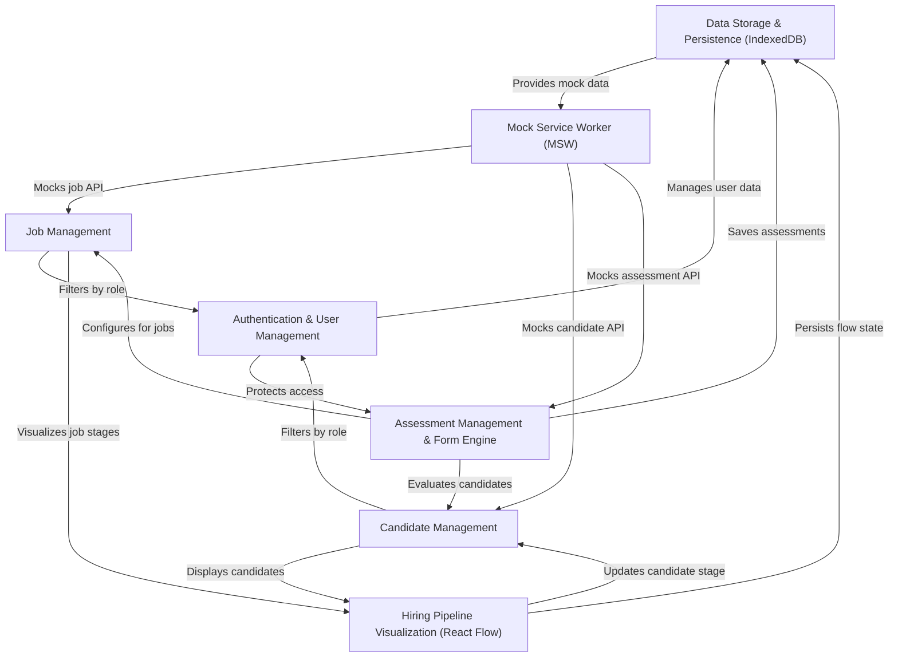
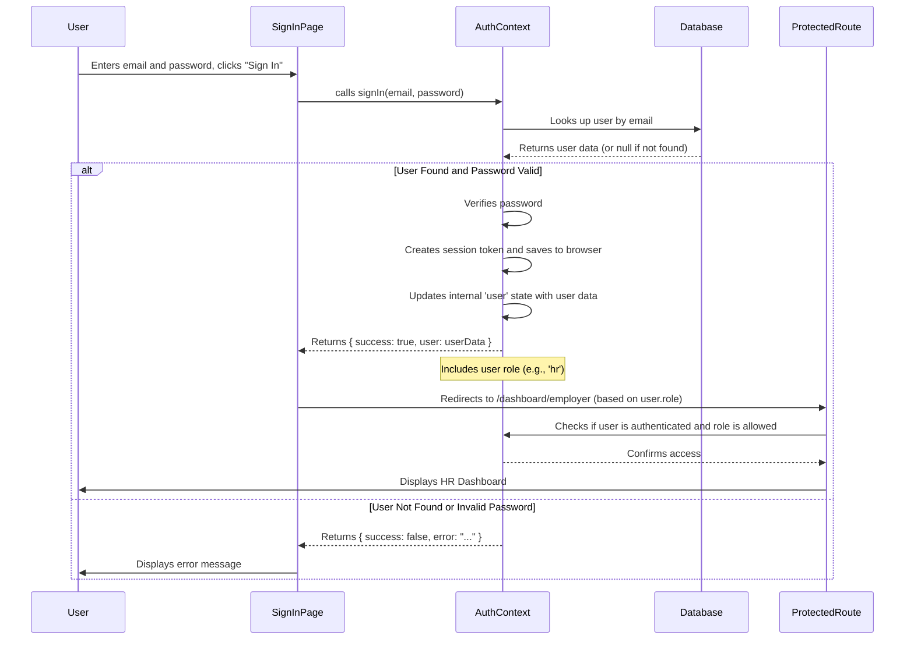
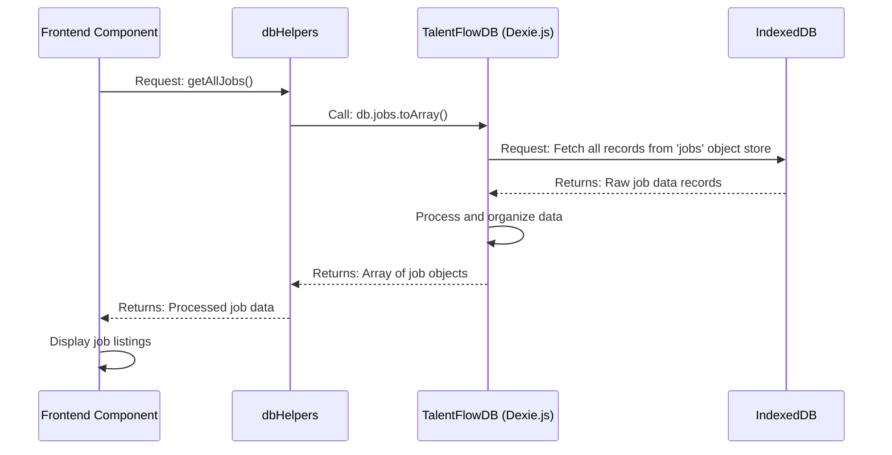
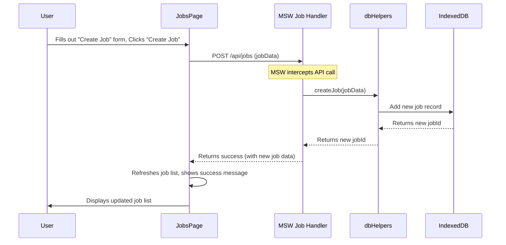
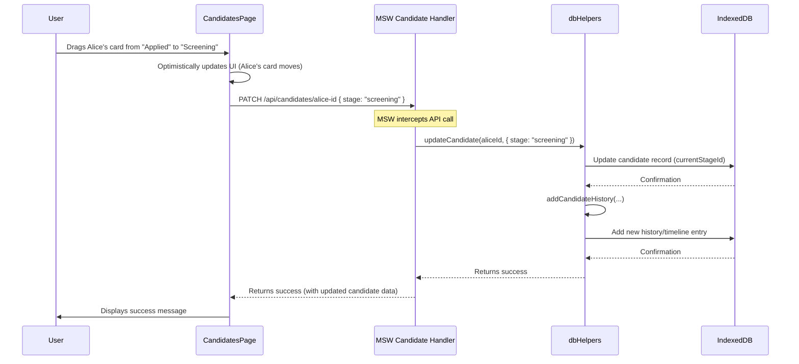
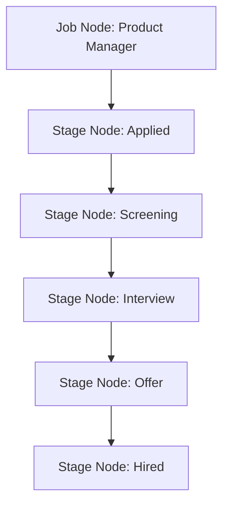
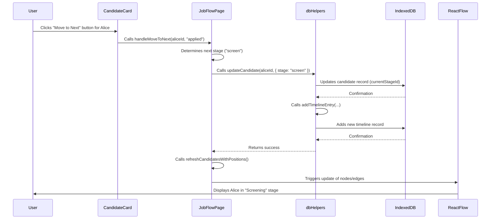
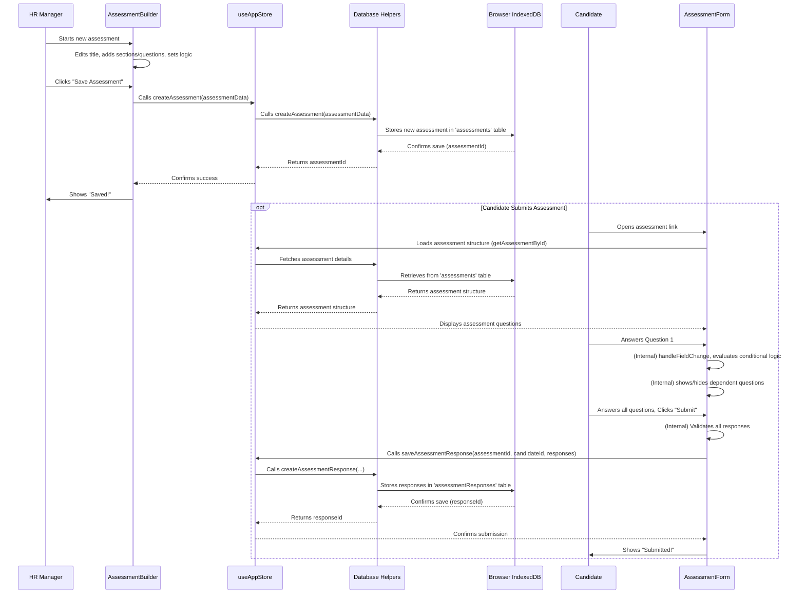
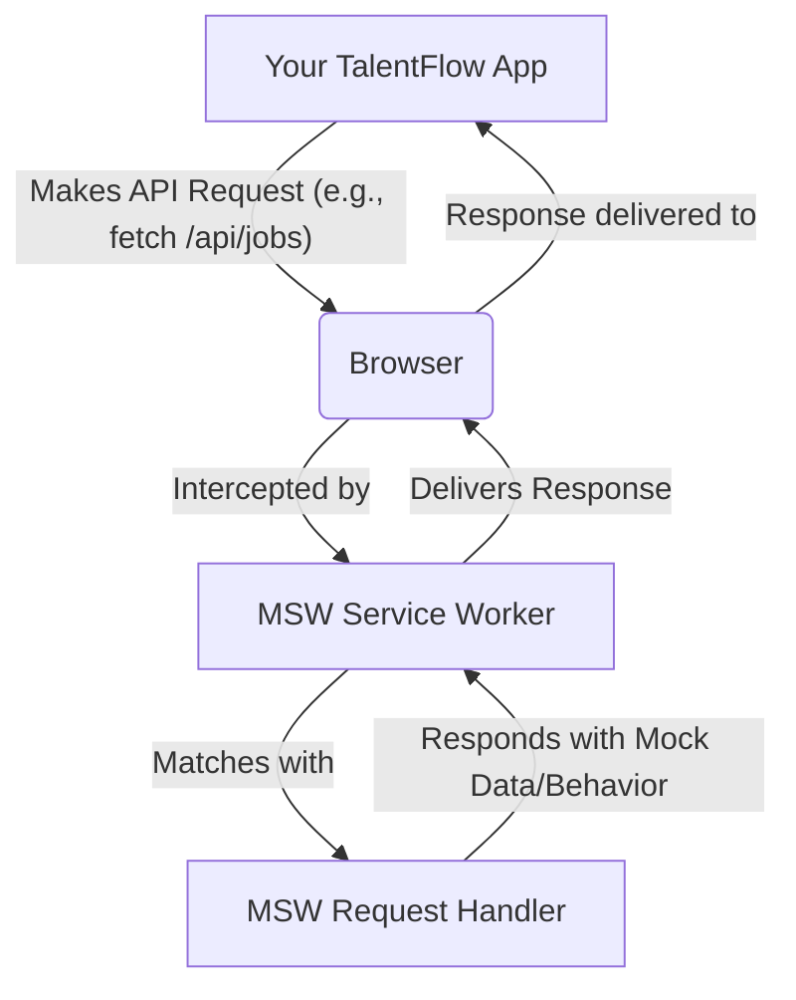
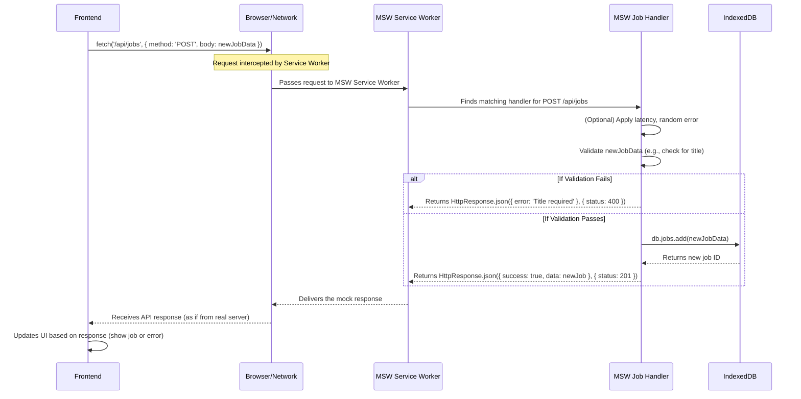

# Tutorial: Talent_flow

The `Talent_flow` project is a comprehensive web application designed to streamline the **recruitment process**. It offers a secure platform with **authentication and user management** for both HR and candidates, storing all data locally in the browser's **IndexedDB** for fast and offline access. HR teams can efficiently manage **job postings** and track **candidate progress** through an interactive **hiring pipeline visualization**, where candidates move between customizable stages. Additionally, it features an advanced **assessment engine** to create and assign job-specific tests, and uses a **Mock Service Worker** for robust development and testing of API interactions.

## Visual Overview



## Chapters

1. [Authentication & User Management](#chapter-1-authentication--user-management)
2. [Data Storage & Persistence (IndexedDB)](#chapter-2-data-storage--persistence-indexeddb)
3. [Job Management](#chapter-3-job-management)
4. [Candidate Management](#chapter-4-candidate-management)
5. [Hiring Pipeline Visualization (React Flow)](#chapter-5-hiring-pipeline-visualization-react-flow)
6. [Assessment Management & Form Engine](#chapter-6-assessment-management--form-engine)
7. [Mock Service Worker (MSW)](#chapter-7-mock-service-worker-msw)

---

# Chapter 1: Authentication & User Management

Welcome to TalentFlow! In this first chapter, we're going to dive into a very important part of any application: knowing who you are and what you're allowed to do. Think of TalentFlow as a special club. Before you can enter or use its facilities, two main things need to happen:

1.  **Authentication**: The bouncer at the door needs to know _who you are_. Are you Bob? Are you Alice? You show your ID (like your username and password).
2.  **Authorization (or User Management)**: Once the bouncer knows who you are, they check the "VIP list." Are you a VIP? Are you a regular member? This determines _what parts of the club you're allowed to access_ and _what actions you can take_.

In TalentFlow, this means we need to handle everything related to user accounts and access. Specifically, we'll cover:

- **Signing up**: Creating a new account (like getting a new club membership card).
- **Logging in**: Proving you are who you say you are (showing your ID).
- **Logging out**: Ending your session (leaving the club).
- **Role-Based Access Control (RBAC)**: Ensuring that HR managers can only see their recruitment tools, and job candidates can only browse jobs or check their applications. It's like HR has access to the "management office," while candidates only have access to the "job board."

Let's imagine a common use case: **An HR Manager wants to sign up for TalentFlow to start managing job openings.** This chapter will show you how TalentFlow handles this, from the signup form to making sure they land on the correct HR dashboard.

---

### What is Authentication? (Who Are You?)

Authentication is simply the process of verifying your identity. When you try to log into an app, you usually provide a username (or email) and a password. The system then checks if these credentials match a registered user. If they do, you're authenticated!

In TalentFlow, when you visit the `/signup` or `/signin` pages, you're interacting with the authentication system.

#### Code Spotlight: Signing In

Let's look at a simplified version of `frontend/src/pages/login/SignInPage.jsx`. This page is where users enter their email and password.

```jsx
// frontend/src/pages/login/SignInPage.jsx (simplified)
import React, { useState } from "react";
import { useAuth } from "../../contexts/AuthContext"; // We'll look at AuthContext soon!

const SignInPage = () => {
  const { signIn } = useAuth(); // We get the signIn function from our AuthContext
  const [formData, setFormData] = useState({ email: "", password: "" });
  const [error, setError] = useState("");

  const handleSubmit = async (e) => {
    e.preventDefault();
    setError("");

    const result = await signIn(formData.email, formData.password); // Calls the signIn function

    if (result.success) {
      // If successful, redirect user based on their role
      // For HR: /dashboard/employer, For Candidate: /dashboard/candidate
      // (Full code handles redirection based on role)
    } else {
      setError(result.error); // Show error message
    }
  };

  return (
    <form onSubmit={handleSubmit}>
      {/* Input fields for email and password */}
      <input
        type="email"
        name="email"
        value={formData.email}
        onChange={handleChange}
      />
      <input
        type="password"
        name="password"
        value={formData.password}
        onChange={handleChange}
      />
      {error && <p>{error}</p>}
      <button type="submit">Sign In</button>
    </form>
  );
};

export default SignInPage;
```

This snippet shows that `SignInPage` collects the email and password, then calls a function called `signIn` from something called `useAuth`. If `signIn` works, the user gets logged in! If not, an error message appears.

---

### What is User Management? (Creating, Logging In, Logging Out)

User management covers all the actions related to handling user accounts. This includes:

- **Registration (Sign Up)**: Creating a new user account.
- **Login (Sign In)**: Authenticating an existing user.
- **Logout (Sign Out)**: Ending a user's authenticated session.
- **Profile Updates**: Allowing users to change their information.

TalentFlow uses a central `AuthContext` to manage all these user-related tasks.

#### Code Spotlight: Signing Up

Here's a simplified look at `frontend/src/pages/login/SignUpPage.jsx`. This page allows new users to create an account, specifying if they are an HR manager or a candidate.

```jsx
// frontend/src/pages/login/SignUpPage.jsx (simplified)
import React, { useState } from "react";
import { useAuth } from "../../contexts/AuthContext";

const SignUpPage = () => {
  const { signUp } = useAuth(); // Get the signUp function
  const [isCandidate, setIsCandidate] = useState(false); // To toggle between HR/Candidate signup
  const [formData, setFormData] = useState({
    /* ... fields like firstName, email, password, companyName */
  });
  const [error, setError] = useState("");

  const handleSubmit = async (e) => {
    e.preventDefault();
    setError("");
    // Basic form validation for passwords matching, required fields (full code has more)

    const result = await signUp({
      ...formData,
      role: isCandidate ? "candidate" : "hr", // Assign role based on toggle
    });

    if (result.success) {
      // Redirect based on role, similar to signIn
      // (Full code handles redirection)
    } else {
      setError(result.error);
    }
  };

  return (
    <form onSubmit={handleSubmit}>
      {/* UI to toggle between HR/Candidate signup */}
      <button type="button" onClick={() => setIsCandidate(!isCandidate)}>
        {isCandidate ? "Sign up as HR?" : "Sign up as Candidate?"}
      </button>

      {/* Input fields for name, email, password */}
      {/* If not candidate, also show companyName field */}
      <input
        type="text"
        name="firstName"
        value={formData.firstName}
        onChange={handleChange}
      />
      {/* ... other fields ... */}
      {!isCandidate && (
        <input
          type="text"
          name="companyName"
          value={formData.companyName}
          onChange={handleChange}
        />
      )}

      {error && <p>{error}</p>}
      <button type="submit">Sign Up</button>
    </form>
  );
};

export default SignUpPage;
```

When a user submits this form, the `signUp` function from `useAuth` is called with all their details, including their chosen role (HR or candidate).

---

### What is Role-Based Access Control (RBAC)? (What Are You Allowed to Do?)

Once you're authenticated (the bouncer knows who you are), RBAC is like checking your VIP status. It decides _what features and data you can see and interact with_ based on your "role."

In TalentFlow, we have two main roles:

- **HR (Human Resources)**: Can create job postings, view candidate profiles, manage the hiring pipeline.
- **Candidate**: Can browse jobs, apply to jobs, manage their profile, take assessments.

You wouldn't want a candidate accidentally deleting a job posting, right? RBAC prevents this!

#### Code Spotlight: Protecting Routes with Roles

TalentFlow uses a special component called `ProtectedRoute` (`frontend/src/components/ProtectedRoute.jsx`) to enforce RBAC. It acts like a gatekeeper for different pages (or "routes").

```jsx
// frontend/src/components/ProtectedRoute.jsx (simplified)
import React from "react";
import { Navigate, useLocation } from "react-router-dom";
import { useAuth } from "../contexts/AuthContext"; // To get current user info

const ProtectedRoute = ({ children, allowedRoles = [] }) => {
  const { user, loading, initialized } = useAuth(); // Get user and loading status
  const location = useLocation();

  if (loading || !initialized) {
    return <div>Loading user info...</div>; // Show a loading spinner
  }

  // If no user is logged in, redirect to the sign-in page
  if (!user) {
    return <Navigate to="/signin" state={{ from: location }} replace />;
  }

  // If roles are specified, check if the user's role is in the allowed list
  if (allowedRoles.length > 0 && !allowedRoles.includes(user.role)) {
    // If not allowed, redirect to their default dashboard or sign-in
    if (user.role === "hr") return <Navigate to="/dashboard" replace />;
    if (user.role === "candidate")
      return <Navigate to="/dashboard/candidate" replace />;
    return <Navigate to="/signin" replace />;
  }

  return children; // If everything is okay, show the page content
};

export default ProtectedRoute;
```

This `ProtectedRoute` checks:

1.  Is a user logged in? If not, send them to `/signin`.
2.  Does the logged-in user have one of the `allowedRoles` for this page? If not, send them to their own dashboard or `/signin`.

This ensures that only HR managers can see the HR dashboard, and only candidates can see the candidate job board.

The `App.jsx` file ties all the routes together using this `ProtectedRoute`:

```jsx
// frontend/src/App.jsx (simplified Routes)
import { Routes, Route, Navigate } from "react-router-dom";
import ProtectedRoute from "./components/ProtectedRoute";
import AnalyticsDashboard from "./components/AnalyticsDashboard"; // HR dashboard
import CandidateDashboardPage from "./pages/candidate-dashboards/CandidateDashboardPage"; // Candidate dashboard

function AppRoutes() {
  return (
    <Routes>
      {/* Public routes */}
      <Route path="/signin" element={<SignInPage />} />
      <Route path="/signup" element={<SignUpPage />} />

      {/* HR Protected Routes */}
      <Route
        path="/dashboard"
        element={
          <ProtectedRoute allowedRoles={["hr"]}>
            <AnalyticsDashboard />
          </ProtectedRoute>
        }
      />
      <Route
        path="/jobs" // HR can view/manage jobs
        element={
          <ProtectedRoute allowedRoles={["hr"]}>
            <JobsPage />
          </ProtectedRoute>
        }
      />

      {/* Candidate Protected Routes */}
      <Route
        path="/dashboard/candidate"
        element={
          <ProtectedRoute allowedRoles={["candidate"]}>
            <CandidateDashboardPage />
          </ProtectedRoute>
        }
      />
      <Route
        path="/dashboard/candidate/jobs" // Candidate can browse jobs
        element={
          <ProtectedRoute allowedRoles={["candidate"]}>
            <CandidateJobsPage />
          </ProtectedRoute>
        }
      />

      {/* Other routes... */}
    </Routes>
  );
}
// ... rest of App.jsx
```

Notice how `allowedRoles={["hr"]}` is used for HR-specific dashboards and pages, while `allowedRoles={["candidate"]}` is used for candidate-specific ones. This is RBAC in action!

---

### Under the Hood: How it Works (Signing In Example)

Let's trace what happens when an HR manager uses the `SignInPage` to log into TalentFlow.

#### Non-Code Walkthrough: The Bouncer Analogy

Imagine our HR manager, Sarah, trying to sign in:

1.  **Sarah enters credentials**: Sarah types her email (`sarah.wilson@techcorp.com`) and password into the `SignInPage` and clicks "Sign In."
2.  **`SignInPage` talks to `AuthContext`**: The `SignInPage` sends Sarah's email and password to the `AuthContext` (our central "Authentication Manager").
3.  **`AuthContext` checks the database**: The `AuthContext` quietly goes to our application's "user list" (the database) and asks, "Is there a user named 'sarah.wilson@techcorp.com' with this password?"
4.  **Database responds**: The database finds Sarah's account and confirms the password. It sends back Sarah's user details (including her `role: 'hr'`) to `AuthContext`.
5.  **`AuthContext` creates a session**: `AuthContext` creates a special "session token" (like a temporary pass) and stores it in Sarah's browser. This token proves she's logged in without needing to re-enter her password every time she visits a new page. It also updates its internal `user` state with Sarah's details.
6.  **`AuthContext` tells `SignInPage`**: `AuthContext` tells the `SignInPage` that the login was successful.
7.  **`SignInPage` redirects**: The `SignInPage` sees the successful login and, because Sarah's role is 'hr', sends her directly to the HR dashboard (`/dashboard/employer`).
8.  **`ProtectedRoute` confirms**: When Sarah lands on `/dashboard/employer`, the `ProtectedRoute` quickly checks with `AuthContext` again. "Is there a user? Yes, Sarah. Is her role 'hr' allowed on `/dashboard/employer`? Yes!" So, Sarah sees her dashboard.

#### Sequence Diagram: Signing In



#### Code Deep Dive: `AuthContext.jsx` - The Core of Authentication

The `frontend/src/contexts/AuthContext.jsx` file is where all the magic for authentication and user management happens. It's built using React's Context API, which allows us to easily share user information and authentication functions throughout our app without passing them down manually through every component.

```jsx
// frontend/src/contexts/AuthContext.jsx (simplified)
import React, { createContext, useContext, useState, useEffect } from "react";
import { dbHelpers } from "../lib/database"; // Helps interact with our local database

const AuthContext = createContext(); // Create a context container

export const useAuth = () => {
  // A custom hook to easily get auth info
  const context = useContext(AuthContext);
  if (!context) throw new Error("useAuth must be used within an AuthProvider");
  return context;
};

// A very basic way to "hash" a password (NOT secure for real apps!)
const hashPassword = (password) => btoa(password + "salt_string");
const verifyPassword = (password, hash) => hashPassword(password) === hash;

export const AuthProvider = ({ children }) => {
  const [user, setUser] = useState(null); // Stores the currently logged-in user
  const [loading, setLoading] = useState(true); // Is authentication check in progress?
  const [initialized, setInitialized] = useState(false); // Has auth system finished its initial setup?

  useEffect(() => {
    // Runs once when the app starts to check for an existing login session
    const initializeAuth = async () => {
      const token = localStorage.getItem("auth_token"); // Look for a saved session token
      if (token) {
        const session = await dbHelpers.getValidSession(token); // Check if token is valid
        if (session) {
          const userData = await dbHelpers.getUserById(session.userId); // Get user details
          if (userData) setUser(userData); // Set the user if valid
        } else {
          localStorage.removeItem("auth_token"); // Remove invalid token
        }
      }
      setInitialized(true);
      setLoading(false);
    };
    initializeAuth();
  }, []); // Empty array means this runs once on mount

  const signUp = async (userData) => {
    // ... logic to check existing user, create company (if HR), hash password
    // ... create user in database using dbHelpers.createUser
    // ... create a new session token, save it to localStorage
    // ... setUser(newUser) to update the app's state
  };

  const signIn = async (email, password) => {
    const userData = await dbHelpers.getUserByEmail(email); // Find user in database
    if (!userData || !verifyPassword(password, userData.password)) {
      throw new Error("Invalid email or password"); // If not found or wrong password
    }
    const token = btoa(`${userData.id}_${Date.now()}_${Math.random()}`); // Generate new token
    await dbHelpers.createSession(userData.id, token); // Save session in database
    localStorage.setItem("auth_token", token); // Save token in browser
    setUser(userData); // Set the logged-in user
    return { success: true, user: userData };
  };

  const signOut = async () => {
    // ... logic to delete session token from database and localStorage
    setUser(null); // Clear the user from app's state
  };

  const value = {
    // This object contains everything we want to share
    user,
    loading,
    initialized,
    signUp,
    signIn,
    signOut,
    // ... other helper functions like isAuthenticated, isHR, etc.
  };

  return <AuthContext.Provider value={value}>{children}</AuthContext.Provider>;
};
```

This `AuthContext` provides functions like `signUp`, `signIn`, and `signOut`, and holds the `user` information. Any component in the app can access this information using `useAuth()`. The actual storage and retrieval of user data (like saving Sarah's details or checking her password) is handled by `dbHelpers`, which we'll learn more about in [Data Storage & Persistence (IndexedDB)](02_data_storage___persistence__indexeddb__.md).

### Conclusion

In this chapter, we've explored the fundamental concept of **Authentication & User Management**. We learned that it's all about verifying who users are, managing their accounts (sign up, sign in, sign out), and controlling what they can do based on their role (HR or Candidate). The `AuthContext` and `ProtectedRoute` components in TalentFlow are key to making this system work smoothly and securely.

Understanding this chapter is crucial because almost every other part of TalentFlow relies on knowing who the user is and what permissions they have. Next, we'll dive into how TalentFlow actually stores all this important user data, along with job listings, candidates, and more, using a clever system called IndexedDB.

---

# Chapter 2: Data Storage & Persistence (IndexedDB)

Welcome back to TalentFlow! In our [Chapter 1: Authentication & User Management](01_authentication___user_management_.md), we learned how TalentFlow identifies users and manages their access. We saw how an HR manager, like Sarah, logs in to the system. But once Sarah is logged in, where does all her data—like the job postings she creates, the candidates she's tracking, and the assessments she designs—actually live? And how can she access it quickly, even if her internet connection decides to take a coffee break?

This is where **Data Storage & Persistence** comes into play. Think of it this way:

- **Persistence** means remembering things. Just like your brain remembers what you had for breakfast, our app needs to remember all your important data even after you close your browser or turn off your computer.
- **Data Storage** is where that remembering actually happens. It's the physical place where the data files are kept.

In TalentFlow, we use a special kind of storage that lives _right inside your web browser_. It's like having a personal, mini-database cabinet built right into your browser, keeping all your important files organized and easily retrievable, even without an internet connection. This is called **IndexedDB**, and we manage it with a friendly helper library called **Dexie.js**.

### What Problem Does Local Storage Solve?

Imagine Sarah, our HR manager, has just logged into TalentFlow. She wants to see a list of all her company's job openings and the candidates applying to them. If this data were stored only on a remote server somewhere far away, every time she opened a new page or refreshed her browser, the app would have to:

1.  Send a request across the internet to the server.
2.  Wait for the server to find the data.
3.  Wait for the data to travel back across the internet.
4.  Display the data.

This can be slow, especially with a shaky internet connection. What if the internet goes out completely? Sarah wouldn't be able to do anything!

Local data storage solves these problems by:

- **Speeding things up**: Data is right there, no need to wait for the internet.
- **Enabling offline work**: Sarah can still view, search, and even _make changes_ to her data, and the app will sync those changes when the internet returns.
- **Reducing server load**: Less data needs to be fetched from the main server.

### Key Concepts: IndexedDB and Dexie.js

Let's break down these two core technologies:

#### 1. IndexedDB: The Browser's Filing Cabinet

IndexedDB is a built-in feature of modern web browsers. It's a powerful, client-side (meaning, on your computer) database for storing large amounts of structured data, including files/blobs. It's designed for web applications that need to work offline or process significant amounts of data locally.

Think of it as a **digital filing cabinet** that belongs _only_ to your web browser. Each website gets its own cabinet, and TalentFlow has its own. Inside this cabinet, there are "drawers" (which we call **Object Stores**), and each drawer holds a specific type of file (like user profiles, job listings, or candidate resumes).

#### 2. Dexie.js: The Friendly Librarian

Working directly with IndexedDB can be a bit complicated, like trying to find a specific file in a huge, unorganized cabinet. That's where **Dexie.js** comes in!

Dexie.js is like a **super-efficient, friendly librarian** for your IndexedDB filing cabinet. Instead of you having to remember complex commands, you just tell Dexie, "Hey, get me all the job listings for TechCorp," and Dexie handles all the complex interactions with IndexedDB behind the scenes. It makes reading, writing, and organizing data much, much simpler.

#### How They Work Together

```mermaid
graph TD
    A[Your TalentFlow App] --> B{Dexie.js (The Librarian)};
    B --> C[IndexedDB (The Filing Cabinet in your Browser)];
    C --> D[Data: Users, Jobs, Candidates];
```

Your TalentFlow application talks to Dexie.js, Dexie.js talks to IndexedDB, and IndexedDB stores and retrieves your data. Simple!

### Solving the Use Case: Getting Job Listings

Let's revisit Sarah, our HR manager. She's just logged in and wants to see her current job listings. Here's how TalentFlow uses IndexedDB (via Dexie.js) to show them to her:

#### The Database Blueprint: `TalentFlowDB`

Before Dexie can store anything, it needs a "blueprint" of how the data should be organized. This blueprint defines what "drawers" (Object Stores or "tables") are in the cabinet and what kind of files they hold.

In TalentFlow, this blueprint is defined in `frontend/src/lib/database.js` as the `TalentFlowDB` class:

```javascript
// frontend/src/lib/database.js (simplified)
import Dexie from "dexie";

export class TalentFlowDB extends Dexie {
  constructor() {
    super("TalentFlowDB"); // Name your database

    // Define your database structure (tables)
    this.version(7).stores({
      users: "++id, email, &username, role, companyId",
      companies: "++id, &name, domain",
      jobs: "++id, companyId, title, status, createdById",
      candidates: "++id, companyId, jobId, name, email, currentStageId",
      // ... many other tables for all app features
    });
  }
}

// Create an instance of our database to use throughout the app
export const db = new TalentFlowDB();
```

**Explanation:**

- `export class TalentFlowDB extends Dexie`: We're creating our own special database, inheriting from Dexie.
- `super('TalentFlowDB')`: This gives our database a name (`TalentFlowDB`).
- `this.version(7).stores({...})`: This defines the structure. `version(7)` means this is the 7th version of our database schema (important for future updates!).
- Inside `stores({...})`, we list our "tables" (Object Stores in IndexedDB terms):
  - `users`: Stores user information. `++id` means `id` is a unique, auto-incrementing number (like an employee ID). `email` and `username` are also indexed for quick lookup.
  - `jobs`: Stores job posting details.
  - `candidates`: Stores candidate profiles.

This `TalentFlowDB` instance, named `db`, is our connection to the browser's local storage.

#### The `dbHelpers` for Easy Access

To make it even easier to interact with our local database, TalentFlow uses a set of "helper" functions called `dbHelpers` (also found in `frontend/src/lib/database.js`). These functions are like pre-written requests you can give to our friendly librarian (Dexie.js).

When Sarah wants to see her jobs, the app calls a helper function like `dbHelpers.getAllJobs()`:

```javascript
// frontend/src/lib/database.js (simplified dbHelpers)
// ... (TalentFlowDB class definition above)

export const dbHelpers = {
  // ... (Other helper functions like createUser, createCompany)

  async getAllJobs() {
    // This is like asking the librarian: "Please give me all the files from the 'jobs' drawer."
    return await db.jobs.toArray();
  },

  async getJobById(id) {
    // "Get me the job file with this specific ID number."
    return await db.jobs.get(id);
  },

  // ... (Many other helper functions for candidates, assessments, etc.)
};
```

**Explanation:**

- `dbHelpers.getAllJobs()`: This function is `async` because talking to a database takes a little bit of time (even if it's local).
- `await db.jobs.toArray()`: This is the core line!
  - `db`: Our instance of `TalentFlowDB` (our database connection).
  - `.jobs`: This refers to the `jobs` table (or Object Store) we defined in our schema.
  - `.toArray()`: This is a Dexie.js method that fetches _all_ records from the `jobs` table and returns them as an array.

This simple call retrieves all job data stored locally in Sarah's browser.

#### Where Does the Initial Data Come From?

When you first open TalentFlow, or if your local database is empty, how does it get its initial data?

In `frontend/src/main.jsx`, the very first file that runs when the app starts, there's a special function call:

```javascript
// frontend/src/main.jsx (simplified)
import { StrictMode } from "react";
import { createRoot } from "react-dom/client";
import App from "./App.jsx";
// ... other imports ...
import {
  initializeDatabase, // This is key!
} from "./lib/initializeDatabase.js";

const startApp = async () => {
  // ... initialize MSW ...

  // Initialize database (auto-seed if empty)
  await initializeDatabase(); // Calls our database setup

  // ... render the app ...
};

startApp();
```

The `initializeDatabase()` function (from `frontend/src/lib/initializeDatabase.js`) checks if there's any data in the local database. If it's empty, it automatically populates it with sample companies, users (including our HR manager Sarah), jobs, and candidates! This is why you see data even if you've never used the app before.

### Under the Hood: How it Works (Getting Job Data Example)

Let's trace what happens when an HR manager (like Sarah) logs in and their browser needs to display a list of jobs.

#### Non-Code Walkthrough: The Librarian Analogy

Imagine Sarah's browser asking for job listings:

1.  **TalentFlow App needs Jobs**: A part of the app (a React component, for example) says, "I need the list of all active jobs."
2.  **App asks `dbHelpers`**: The app sends this request to our `dbHelpers` (the chief assistant to the librarian).
3.  **`dbHelpers` asks `db` (Dexie.js)**: `dbHelpers` translates the request into a simpler instruction for `db` (our Dexie.js librarian): "Go to the `jobs` drawer and get me everything."
4.  **`db` (Dexie.js) talks to `IndexedDB`**: Dexie.js then communicates with the actual browser's `IndexedDB` (the physical filing cabinet) and says, "Open the `jobs` drawer and give me all the files."
5.  **`IndexedDB` retrieves files**: The browser's `IndexedDB` finds all the job files, bundles them up.
6.  **`IndexedDB` gives files to `db` (Dexie.js)**: It hands these raw files back to Dexie.js.
7.  **`db` (Dexie.js) organizes files**: Dexie.js takes the raw data, organizes it neatly into a list (an array of JavaScript objects).
8.  **`db` (Dexie.js) gives organized data to `dbHelpers`**: Dexie.js passes this neat list back to `dbHelpers`.
9.  **`dbHelpers` gives data to App**: `dbHelpers` then delivers the ready-to-use list of job objects back to the TalentFlow component that requested it.
10. **App displays Jobs**: The app now has the data and can display the job listings to Sarah.

#### Sequence Diagram: Getting All Jobs



#### Code Deep Dive: `dbHelpers` and Data Retrieval

Let's look at a concrete example within TalentFlow's codebase for how this is used. In [Chapter 1: Authentication & User Management](01_authentication___user_management_.md), we briefly saw `AuthContext.jsx` using `dbHelpers` to get user data. This is another example of data retrieval.

```javascript
// frontend/src/contexts/AuthContext.jsx (simplified for database interaction)
// ... imports ...
import { dbHelpers } from "../lib/database"; // Our friendly librarian

export const AuthProvider = ({ children }) => {
  // ... state variables like user, loading ...

  useEffect(() => {
    const initializeAuth = async () => {
      const token = localStorage.getItem("auth_token");
      if (token) {
        const session = await dbHelpers.getValidSession(token); // Get session from local DB
        if (session) {
          const userData = await dbHelpers.getUserById(session.userId); // Get user details from local DB
          if (userData) setUser(userData); // Update app's user state
        }
      }
      // ... update loading/initialized state ...
    };
    initializeAuth();
  }, []);

  const signIn = async (email, password) => {
    const userData = await dbHelpers.getUserByEmail(email); // Get user from local DB by email
    // ... verify password, create session, save token ...
    setUser(userData);
    return { success: true, user: userData };
  };

  // ... signUp, signOut functions ...
};
```

**Explanation:**

- **`dbHelpers.getValidSession(token)`**: When the app starts, it checks for a saved `auth_token`. This token is then used to look up an active session in the local `sessions` table of our IndexedDB.
- **`dbHelpers.getUserById(session.userId)`**: If a valid session is found, it uses the `userId` from that session to fetch the complete user profile from the `users` table.
- **`dbHelpers.getUserByEmail(email)`**: During sign-in, the provided email is used to find a matching user record in the `users` table.

These calls are quick because they're reading directly from the browser's local storage. This fast access helps `AuthContext` quickly determine who the user is without relying on a slow network request every time.

### Conclusion

In this chapter, we've explored the crucial role of **Data Storage & Persistence** in TalentFlow. We learned that by using **IndexedDB** as our browser's local "filing cabinet" and **Dexie.js** as our "friendly librarian," TalentFlow can store all your important data—users, jobs, candidates, assessments, and more—directly in your browser. This enables fast data access and even lets you work offline, making your experience smooth and reliable.

Understanding how data is stored locally is fundamental because it underpins the responsiveness and offline capabilities of the entire application. Next, we'll put this storage to use as we dive into **Job Management**, seeing how HR managers can create, view, and manage job postings, all powered by our robust local data storage system.

---

# Chapter 3: Job Management

Welcome back to TalentFlow! In [Chapter 1: Authentication & User Management](01_authentication___user_management_.md), we saw how users like Sarah, our HR manager, can log in. Then, in [Chapter 2: Data Storage & Persistence (IndexedDB)](02_data_storage___persistence__indexeddb__.md), we learned that all important information, including job postings, is stored right in your browser using IndexedDB.

Now that Sarah is logged in and we know where data lives, what's next? Sarah needs to actually manage the jobs her company is trying to fill! This is where **Job Management** comes in.

Imagine this: **Sarah, an HR Manager at TechCorp, wants to create a new job posting for a "Software Engineer" position.** She needs a way to add all the details, make sure it's visible to candidates, and later, perhaps update its status or change its priority. This chapter will show you how TalentFlow handles all these job-related tasks.

### What is Job Management?

Job Management is like having a powerful **digital bulletin board** and an **administrative control center** rolled into one. It's the core system within TalentFlow that handles everything about job openings.

For **HR users** (like Sarah):

- You can **create** brand new job postings, adding details like the title, a detailed description, location, and its current status (e.g., "Active" or "Archived").
- You can **view** all existing job postings, search through them, and filter them.
- You can **update** job details if anything changes, like adjusting the description or changing the status.
- You can even **reorder** jobs to prioritize which ones appear first on the candidate job board.
- It's integrated with the visual hiring pipeline, meaning each job is the starting point for tracking candidates through different stages.

For **Candidates**:

- They can **browse** all available job postings.
- They can **apply** to positions they are interested in.

In short, Job Management is the brain that organizes all the company's hiring needs and open roles.

### Key Concepts in Job Management

Let's break down the main things you can do with jobs in TalentFlow:

1.  **Creating a Job**: Adding a completely new job opening.
2.  **Viewing & Updating Jobs**: Looking at all jobs and making changes to existing ones.
3.  **Job Status**: Changing if a job is "Active" (visible to candidates) or "Archived" (hidden).
4.  **Reordering Jobs**: Changing the display order of jobs on a list, usually with drag-and-drop.
5.  **Visual Hiring Pipeline Integration**: Each job gets its own visual workflow for candidates.

### Solving the Use Case: Creating a New Job

Let's walk through how Sarah creates her "Software Engineer" job posting.

#### 1. The User Interface (UI)

Sarah would navigate to the "Jobs" page in TalentFlow. There, she'd see a "Create Job" button. Clicking this button brings up a simple form.

Here's a simplified look at the `JobModal` component (from `frontend/src/pages/flow/JobsPage.jsx`) that handles creating and editing jobs:

```jsx
// frontend/src/pages/flow/JobsPage.jsx (JobModal simplified)
const JobModal = ({ job, onSave, onClose }) => {
  const [formData, setFormData] = useState({
    title: job?.title || "",
    status: job?.status || "active",
    // ... other fields like tags, description
  });

  const handleSubmit = (e) => {
    e.preventDefault();
    if (!formData.title.trim()) {
      alert("Job title is required"); // Basic validation
      return;
    }
    onSave(formData); // Call the onSave function provided by parent
  };

  return (
    <form onSubmit={handleSubmit}>
      <label>Job Title *</label>
      <input
        type="text"
        value={formData.title}
        onChange={(e) => setFormData({ ...formData, title: e.target.value })}
        required
      />
      <label>Status</label>
      <select
        value={formData.status}
        onChange={(e) => setFormData({ ...formData, status: e.target.value })}
      >
        <option value="active">Active</option>
        <option value="archived">Archived</option>
      </select>
      {/* ... other input fields for description, tags, etc. */}
      <button type="submit">{job ? "Update Job" : "Create Job"}</button>
      <button type="button" onClick={onClose}>
        Cancel
      </button>
    </form>
  );
};
```

**Explanation:**
This `JobModal` is a reusable form. When Sarah opens it to "Create Job," `job` will be `null`, so the form fields will be empty. She types in the "Job Title," selects a "Status," and fills out other details. When she clicks "Create Job," the `handleSubmit` function is called, which then triggers the `onSave` function provided by the main `JobsPage`.

#### 2. The `JobsPage` Calls the "API"

The `JobsPage` has a function called `handleCreateJob` (also in `frontend/src/pages/flow/JobsPage.jsx`) that acts as an intermediary. It takes the data from the form and sends it off to be saved.

```javascript
// frontend/src/pages/flow/JobsPage.jsx (simplified handleCreateJob)
const JobsPage = () => {
  // ... state and other functions ...

  const handleCreateJob = async (jobData) => {
    try {
      const response = await fetch("/api/jobs", { // This sends the data!
        method: "POST",
        headers: { "Content-Type": "application/json" },
        body: JSON.stringify(jobData),
      });

      if (!response.ok) {
        throw new Error(`Failed to create job: ${response.statusText}`);
      }

      await fetchJobs(); // Refresh the list of jobs displayed
      setShowCreateModal(false);
      showSuccess(`Job "${jobData.title}" created successfully! 🎉`, 5000);
    } catch (err) {
      console.error("Error creating job:", err);
      showError("Failed to create job: " + err.message, 6000);
    }
  };

  // ... rest of JobsPage component ...
  return (
    // ... UI for JobsPage, including the JobModal ...
  );
};
```

**Explanation:**
When `handleCreateJob` is called, it makes a network request (`fetch`) to `/api/jobs` using the `POST` method. This `POST` request carries the `jobData` (title, status, description, etc.) that Sarah entered. After the job is successfully saved, the page automatically refreshes to show the new job, and a "success" message pops up.

### Under the Hood: How a Job is Created

Now, let's see what happens _behind the scenes_ when `handleCreateJob` sends that `fetch` request.

#### Non-Code Walkthrough: The Form to the Filing Cabinet

Think of it like this:

1.  **Sarah fills the form**: She writes down all the job details on a paper form.
2.  **`JobsPage` sends the form**: The `JobsPage` component takes Sarah's filled-out form and gives it to a messenger (`fetch`). The messenger's job is to send this form to the "Job Creation Department" (our `/api/jobs` endpoint).
3.  **"Job Creation Department" (MSW) receives**: The messenger delivers the form to the "Job Creation Department," which is actually handled by our Mock Service Worker (MSW) (we'll learn more about MSW in [Mock Service Worker (MSW)](07_mock_service_worker__msw__.md)). MSW pretends to be a real server.
4.  **MSW asks the Librarian (Dexie.js)**: The MSW "department head" then takes the job details and asks our friendly librarian (`dbHelpers` from [Data Storage & Persistence (IndexedDB)](02_data_storage___persistence__indexeddb__.md)), "Please add this new job to the 'jobs' drawer in our main filing cabinet."
5.  **Librarian saves to Filing Cabinet (IndexedDB)**: The librarian (`dbHelpers`) uses Dexie.js to store the new job's information in the `jobs` "table" (Object Store) inside the browser's IndexedDB. It also gives the job a unique ID.
6.  **Librarian confirms**: The librarian tells the MSW "department head" that the job is saved and provides its new ID.
7.  **MSW confirms to `JobsPage`**: The MSW "department head" tells the `JobsPage` that the job was successfully created.
8.  **`JobsPage` updates**: The `JobsPage` now knows the job is saved, so it refreshes its list to include the new job and shows Sarah a success message.

#### Sequence Diagram: Creating a Job



#### Code Deep Dive: Saving the Job

Let's look at the actual code that performs the saving:

**1. The MSW Interceptor (`frontend/src/mocks/jobHandlers.js`)**

This file contains the "mock server" logic that intercepts requests to `/api/jobs`. It acts like a temporary server for our frontend, interacting directly with IndexedDB.

```javascript
// frontend/src/mocks/jobHandlers.js (simplified)
import { http, HttpResponse } from "msw";
import { db } from "../lib/database.js"; // Our IndexedDB connection

export const jobHandlers = [
  http.post("/api/jobs", async ({ request }) => {
    const body = await request.json(); // Get job data from the request

    // ... (validation logic, calculate next order) ...

    const newJob = {
      ...body,
      status: body.status || "active",
      createdAt: new Date(),
      updatedAt: new Date(),
      // ... other default fields
    };

    const jobId = await db.jobs.add(newJob); // Add job to IndexedDB
    const createdJob = await db.jobs.get(jobId); // Fetch the newly created job

    console.log("✅ [MSW] Job created in IndexedDB:", jobId);
    return HttpResponse.json(
      { success: true, data: createdJob },
      { status: 201 }
    );
  }),
  // ... other handlers for GET, PATCH, DELETE ...
];
```

**Explanation:**
The `http.post('/api/jobs', ...)` function "catches" the `POST` request from `JobsPage`. It extracts the `jobData` from the request body, adds some default values and timestamps, and then calls `db.jobs.add(newJob)`. Remember from Chapter 2, `db.jobs` is our Dexie.js "table" for jobs, and `.add()` is how we put a new record into it. It then returns a success response with the newly created job.

**2. The Database Helper (`frontend/src/lib/database.js`)**

While the MSW directly uses `db.jobs.add()`, in other parts of the app (like the `useJobs` hook), we have helper functions to encapsulate these database interactions.

```javascript
// frontend/src/lib/database.js (simplified dbHelpers for job creation)
import Dexie from "dexie";

// ... (TalentFlowDB class definition) ...

export const dbHelpers = {
  // ... (User & Company helpers) ...

  async createJob(jobData) {
    const job = {
      ...jobData,
      createdAt: new Date(),
      updatedAt: new Date(),
    };
    return await db.jobs.add(job); // Uses Dexie to add the job
  },

  // ... (Other job, candidate, assessment helpers) ...
};
```

**Explanation:**
The `createJob` function here simply takes the `jobData`, adds `createdAt` and `updatedAt` timestamps, and then uses `db.jobs.add(job)` to save it to our IndexedDB. This function is called by `useJobs` (which we'll see later) when not using MSW, or it could be called directly by components if needed, providing a consistent way to interact with the database.

### Managing Existing Jobs: View, Update, Reorder

Once jobs are created, HR managers need powerful tools to manage them.

#### 1. Viewing Jobs

The `JobsPage` displays all jobs, allowing HR to search, filter, and sort them.

```jsx
// frontend/src/pages/flow/JobsPage.jsx (simplified job list item)
return (
  // ... filters, buttons ...
  <div className="bg-white ...">
    {jobs.length > 0 ? (
      jobs.map((job) => (
        <div key={job.id} className="p-6 ...">
          <div className="flex items-center justify-between">
            <div className="flex-1 cursor-pointer" onClick={() => (window.location.href = `/jobs/${job.id}`)}>
              <h3 className="text-lg font-semibold text-blue-600 ...">
                {job.title}
              </h3>
              <span className={`px-3 py-1 ... ${job.status === "active" ? "bg-green-100 ..." : "bg-gray-100 ..."}`}>
                {job.status}
              </span>
              <p className="mt-2 text-sm text-gray-600 ...">
                Created: {new Date(job.createdAt).toLocaleDateString()} • Order: {job.order}
              </p>
            </div>
            <div className="flex items-center space-x-3">
              <Link to={`/jobs/${job.id}/flow`} className="...">Flow Editor</Link>
              <button onClick={() => setEditingJob(job)} className="...">Edit</button>
            </div>
          </div>
        </div>
      ))
    ) : (
      // ... No jobs found message ...
    )}
  </div>
);
```

**Explanation:**
This `JobsPage` uses the `jobs` state (which is populated by `fetchJobs` calling `/api/jobs` via MSW) to map over each job and display its title, status, creation date, and current order. It also provides buttons for editing and navigating to the flow editor.

#### 2. Updating Jobs (Status, Description, etc.)

Clicking "Edit" on a job brings up the same `JobModal` we saw earlier, but this time `job` data is passed to it, pre-filling the fields. Submitting the form calls `handleUpdateJob`.

```javascript
// frontend/src/pages/flow/JobsPage.jsx (simplified handleUpdateJob)
const JobsPage = () => {
  // ... state and other functions ...

  const handleUpdateJob = async (jobId, updates) => {
    try {
      const response = await fetch(`/api/jobs/${jobId}`, {
        // PATCH request
        method: "PATCH",
        headers: { "Content-Type": "application/json" },
        body: JSON.stringify(updates),
      });

      if (!response.ok) {
        throw new Error(`Failed to update job: ${response.statusText}`);
      }

      await fetchJobs(); // Refresh list
      setEditingJob(null); // Close modal
      showSuccess(
        `Job "${updates.title || "Job"}" updated successfully! ✅`,
        4000
      );
    } catch (err) {
      console.error("Error updating job:", err);
      showError("Failed to update job: " + err.message, 6000);
    }
  };

  // ... rest of JobsPage component ...
};
```

**Explanation:**
The `handleUpdateJob` function sends a `PATCH` request to `/api/jobs/:id` with the `jobId` and the `updates`. This works similarly to `createJob` but updates an existing record in IndexedDB via the MSW handler.

#### 3. Reordering Jobs

TalentFlow also allows HR managers to reorder jobs using a simple drag-and-drop interface directly on the `JobsPage`. When a job is dragged to a new position, the `handleReorderJobs` function is triggered.

```javascript
// frontend/src/pages/flow/JobsPage.jsx (simplified handleReorderJobs)
const JobsPage = () => {
  // ... state and other functions like handleDragStart, handleDrop ...

  const handleReorderJobs = async (newJobsOrder) => {
    try {
      setAllJobs(newJobsOrder); // Update local state immediately for smooth UX

      const jobsWithNewOrders = newJobsOrder.map((job, index) => ({
        id: job.id,
        order: index + 1, // Assign new order based on position in array
      }));

      // Directly update IndexedDB for persistence
      await dbHelpers.reorderJobs(jobsWithNewOrders);
      showSuccess(`Jobs reordered successfully! ✨ New order saved.`, 4000);

      // (Optional) Also try to update via API for external sync
      // ... fetch('/api/jobs/:id/reorder', ...)

      await fetchJobs(); // Refresh main list
    } catch (err) {
      console.error("❌ Error reordering jobs:", err);
      showError("Failed to save job order: " + err.message, 6000);
    }
  };
  // ... rest of JobsPage ...
};
```

**Explanation:**
When jobs are reordered visually, `handleReorderJobs` is called with the new sequence of jobs. It then iterates through this `newJobsOrder` array, assigns a new `order` number to each job based on its position, and calls `dbHelpers.reorderJobs` to save these changes to IndexedDB.

Here's how `dbHelpers.reorderJobs` (from `frontend/src/lib/database.js`) looks:

```javascript
// frontend/src/lib/database.js (simplified dbHelpers for reordering)
export const dbHelpers = {
  // ... other helpers ...

  async reorderJobs(jobsWithNewOrders) {
    try {
      // Use a Dexie transaction for atomicity (all or nothing)
      await db.transaction("rw", db.jobs, async () => {
        for (const { id, order } of jobsWithNewOrders) {
          await db.jobs.update(id, { order: order, updatedAt: new Date() });
        }
      });
      return true;
    } catch (error) {
      console.error("🗄️ Database: Failed to reorder jobs:", error);
      throw error;
    }
  },

  // ... other helpers ...
};
```

**Explanation:**
`reorderJobs` uses a Dexie.js `transaction`. A transaction ensures that if any one update fails, _all_ updates are rolled back, preventing half-saved data. It iterates through the list of jobs and updates their `order` and `updatedAt` fields in the `jobs` table.

#### 4. Visual Hiring Pipeline Integration

Every job in TalentFlow is linked to a visual hiring pipeline. When an HR manager views a specific job (e.g., by clicking "Flow Editor"), they see a diagram representing the recruitment stages (Applied, Screening, Interview, etc.).

The `JobNode` component (from `frontend/src/components/flow/JobNode.jsx`) is what represents a job within this visual flow.

```jsx
// frontend/src/components/flow/JobNode.jsx (simplified)
import React from "react";
import { Handle, Position } from "@xyflow/react";
import { Briefcase, Users } from "lucide-react";

const JobNode = ({ data }) => {
  const { title, status, applicants, description, id } = data; // Job data from flow
  const isArchived = status === "Archived";

  return (
    <div
      className={`w-[28rem] rounded-xl shadow-lg border ${
        isArchived ? "border-gray-200 bg-gray-50" : "border-gray-200 bg-white"
      } `}
    >
      <div className="p-5">
        <div className="flex items-center gap-4">
          <Briefcase
            className={`w-6 h-6 ${
              isArchived ? "text-gray-400" : "text-primary-400"
            }`}
          />
          <div>
            <h3
              className={`font-bold text-lg text-gray-800 ${
                isArchived ? "line-through text-gray-500" : ""
              }`}
            >
              {title}
            </h3>
            <span
              className={`inline-flex items-center ... ${
                isArchived ? "bg-gray-200 ..." : "bg-teal-100 ..."
              }`}
            >
              {status}
            </span>
            <div className="flex items-center gap-1.5 text-gray-500 text-xs font-medium">
              <Users className="w-3.5 h-3.5" />
              <span>{applicants} Applicants</span>
            </div>
          </div>
        </div>
        {description && (
          <p
            className={`mt-4 text-sm text-gray-700 ${
              isArchived ? "text-gray-400" : ""
            }`}
          >
            {description}
          </p>
        )}
      </div>
      <Handle
        type="source"
        position={Position.Bottom}
        className="w-4 h-4 !bg-gray-300"
      />
    </div>
  );
};

export default JobNode;
```

**Explanation:**
This component defines how a "job" looks when displayed in the visual hiring pipeline (which is built using `react-flow`, as we'll see in [Hiring Pipeline Visualization (React Flow)](05_hiring_pipeline_visualization__react_flow__.md)). It takes `data` (which includes job `title`, `status`, `applicants`, `description`) and renders a visually appealing card. The `Handle` component allows it to connect to other nodes (representing stages) in the pipeline.

### Candidate's Perspective

While HR is busy managing jobs, candidates interact with a different part of TalentFlow. When a candidate logs in, they can browse available positions. This functionality also relies on our `dbHelpers` and the `jobs` table. For example, a candidate's job board might simply call `dbHelpers.getAllJobs()` or `dbHelpers.getJobsByCompany(companyId)` to fetch a list of active job postings. This data is then displayed in a user-friendly format, allowing them to view details and apply.

### Conclusion

In this chapter, we've explored the core concept of **Job Management** in TalentFlow. We learned how HR managers can effectively create, view, update, and reorder job postings, making it easy to keep track of all open positions. This entire system relies on our local data storage (IndexedDB via Dexie.js) to provide a fast and reliable experience, with MSW acting as a helpful mock server during development. We also briefly touched on how these jobs integrate with the visual hiring pipeline and how candidates interact with them.

Understanding Job Management is key because these job postings are the foundation for the entire recruitment process. Next, we'll dive into **Candidate Management**, learning how TalentFlow tracks and nurtures the individuals applying to these jobs.

---

# Chapter 4: Candidate Management

Welcome back to TalentFlow! In [Chapter 1: Authentication & User Management](01_authentication___user_management_.md), we learned how users like HR manager Sarah log in. In [Chapter 2: Data Storage & Persistence (IndexedDB)](02_data_storage___persistence__indexedDB__.md), we discovered how all important data, including job postings and candidate details, is stored directly in your browser. Then, in [Chapter 3: Job Management](03_job_management_.md), we saw how Sarah could create and manage these job postings.

Now, with job openings ready, the next step is to manage the people who apply: the **candidates**! This is where **Candidate Management** comes in.

Imagine this: **Sarah, our HR Manager, has posted a new "Software Engineer" job. Several candidates, like Alice, Bob, and Charlie, have applied. Sarah needs a way to track each candidate's application, see their details, move them through different interview stages, add private notes about their performance, and review their entire history with the company.**

This chapter will show you how TalentFlow makes this process smooth and efficient, like having a dedicated digital assistant for every applicant.

### What is Candidate Management?

Candidate Management is the core system for tracking and interacting with job applicants throughout their entire hiring journey. Think of it as a **digital folder for each candidate**, packed with everything you need to know about them, from their initial application to their final hiring status.

For **HR users** (like Sarah):

- You can **view individual candidate profiles**, seeing all their contact details, resume, and application specifics.
- You can **manage their progress** through different hiring stages (like "Applied," "Screening," "Interview," "Offer," "Hired," or "Rejected"), often using a visual Kanban board.
- You can **add internal notes** about their interviews, assessments, or general impressions, sharing insights with your team.
- You can **review their full activity timeline**, seeing every interaction, stage change, and note logged during their journey.
- You can **create new candidates** manually if an application comes in outside the normal process.

In essence, Candidate Management ensures that no applicant gets lost, and all relevant information is easily accessible, providing a clear overview of where each person stands in the recruitment process.

### Key Concepts in Candidate Management

Let's break down the main features for managing candidates:

1.  **Candidate Profile**: A central place to see all details for one applicant.
2.  **Hiring Pipeline/Stages**: Visualizing candidates moving through different steps (often a Kanban board).
3.  **Internal Notes**: Private comments about a candidate, visible only to the HR team.
4.  **Activity Timeline**: A chronological log of everything that has happened with a candidate.
5.  **Adding Candidates**: Manually submitting new candidate details into the system.

### Solving the Use Case: Tracking and Interacting with Candidates

Let's follow Sarah as she manages Alice, a candidate for the "Senior Frontend Developer" role.

#### 1. Viewing the Candidate Kanban Board

Sarah's first stop is the "Candidates" page, which presents a visual **Kanban board**. This board organizes candidates into columns, where each column represents a stage in the hiring pipeline (e.g., "Applied," "Screening," "Technical," "Offer").

Here's how the `CandidatesPage.jsx` sets up the board using `KanbanColumn` and `DraggableCandidateCard`:

```jsx
// frontend/src/pages/hr-dashboards/CandidatesPage.jsx (simplified KanbanView)
const KanbanView = React.memo(
  ({ stages, candidatesByStage, jobs, onStageChange }) => {
    return (
      <div className="grid grid-cols-1 md:grid-cols-3 lg:grid-cols-6 gap-6">
        {stages.map(
          (
            stage // Loop through each hiring stage
          ) => (
            <DroppableColumn // Each stage is a column
              key={stage.id}
              stage={stage}
              candidatesByStage={candidatesByStage}
              jobs={jobs}
              onStageChange={onStageChange}
              stages={stages}
            />
          )
        )}
      </div>
    );
  }
);

const DroppableColumn = React.memo(
  ({ stage, candidatesByStage, jobs, onStageChange, stages }) => {
    const { setNodeRef, isOver } = useDroppable({ id: stage.id }); // Makes column a drop target
    const candidates = candidatesByStage[stage.id] || []; // Candidates in this stage

    return (
      <div ref={setNodeRef} className="...">
        {" "}
        {/* Column UI */}
        <h3 className="..."> {stage.name} </h3>
        <div className="space-y-3 flex-1">
          <SortableContext
            items={candidates.map((c) => c.id)}
            strategy={verticalListSortingStrategy}
          >
            {candidates.map((candidate) => (
              <DraggableCandidateCard // Each candidate is a draggable card
                key={candidate.id}
                candidate={candidate}
                stages={stages}
                jobs={jobs}
                onStageChange={onStageChange}
              />
            ))}
          </SortableContext>
        </div>
      </div>
    );
  }
);
```

**Explanation:**
The `KanbanView` maps over a list of `stages` (like 'Applied', 'Screening') to create a `DroppableColumn` for each. Inside each `DroppableColumn`, `DraggableCandidateCard` components display the candidates assigned to that stage. This structure makes it easy to see all candidates at a glance and their current stage.

#### 2. Moving a Candidate Through Stages (Drag-and-Drop)

Alice has passed the initial review and is ready for a phone screen. Sarah can simply **drag Alice's candidate card from the "Applied" column to the "Screening" column**.

This drag-and-drop action triggers the `handleDragEnd` function in `CandidatesPage.jsx`:

```javascript
// frontend/src/pages/hr-dashboards/CandidatesPage.jsx (simplified handleDragEnd)
const CandidatesPage = () => {
  // ... (state, other functions) ...

  const handleDragEnd = async (event) => {
    const { active, over } = event;
    if (!over || active.id === over.id) return; // Dropped nowhere or on self

    const candidateId = active.id;
    const newStage = over.id; // The ID of the column where it was dropped

    // ... (logic to find candidate, validate stage, prevent backward moves) ...

    // Optimistic update: Update local state immediately for smooth UI
    setAllCandidates((prev) =>
      prev.map((c) => (c.id === candidateId ? { ...c, stage: newStage } : c))
    );

    try {
      // Update candidate stage in IndexedDB
      await dbHelpers.updateCandidate(candidateId, { stage: newStage });

      showSuccess(`${candidate?.name} moved to ${stageName}`);

      // Log this action to the timeline (non-blocking)
      // await dbHelpers.logStageChange(candidate, oldStageName, stageName, job);
    } catch (error) {
      showError(`Error updating candidate stage: ${error.message}`);
      // Revert optimistic update on error
      setAllCandidates(allCandidates);
    }
    // ... (reset drag state) ...
  };
  // ...
};
```

**Explanation:**
The `handleDragEnd` function gets the `candidateId` and the `newStage` (the ID of the column where the card was dropped). It first updates the local list of candidates (`setAllCandidates`) to give immediate visual feedback. Then, it calls `dbHelpers.updateCandidate` to save this change permanently in our IndexedDB. A success message appears, and the movement is logged in the candidate's activity timeline.

#### 3. Viewing a Candidate's Full Profile

To dive deeper into Alice's application, Sarah clicks on Alice's card. This takes her to the `CandidateProfilePage.jsx`.

```jsx
// frontend/src/pages/hr-dashboards/CandidateProfilePage.jsx (simplified fetch)
const CandidateProfilePage = () => {
  const { candidateId } = useParams(); // Get ID from URL
  const [candidate, setCandidate] = useState(null);
  const [job, setJob] = useState(null);
  const [timelineEntries, setTimelineEntries] = useState([]);
  const [loading, setLoading] = useState(true);

  useEffect(() => {
    const fetchCandidateData = async () => {
      try {
        setLoading(true);
        // Fetch candidate details from IndexedDB
        const candidateData = await dbHelpers.getCandidateById(
          parseInt(candidateId)
        );
        setCandidate(candidateData);

        // Fetch job details (e.g., "Senior Frontend Developer")
        if (candidateData.jobId) {
          const jobData = await dbHelpers.getJobById(candidateData.jobId);
          setJob(jobData);
        }

        // Fetch activity timeline
        const timelineData = await dbHelpers.getTimelineEntries(
          parseInt(candidateId)
        );
        setTimelineEntries(timelineData);
      } catch (err) {
        // ... error handling ...
      } finally {
        setLoading(false);
      }
    };
    if (candidateId) fetchCandidateData();
  }, [candidateId]); // Re-fetch if candidateId changes

  // ... (rendering candidate details, notes, timeline) ...
  return (
    <div>
      {/* Displays candidate.name, candidate.email, job.title, etc. */}
      {/* NotesSection component */}
      {/* Timeline component */}
    </div>
  );
};
```

**Explanation:**
The `CandidateProfilePage` uses `dbHelpers` to fetch all relevant data for the `candidateId` from our IndexedDB:

- `dbHelpers.getCandidateById()` gets Alice's core profile.
- `dbHelpers.getJobById()` retrieves the job she applied for.
- `dbHelpers.getTimelineEntries()` fetches her entire activity history.

All this information is then displayed, giving Sarah a complete overview.

#### 4. Adding Internal Notes

During Alice's phone screen, Sarah takes some notes. She clicks "Add Note" on Alice's profile, types her comments, and saves them.

The `NotesModal` component handles this:

```jsx
// frontend/src/components/NotesModal.jsx (simplified)
const NotesModal = ({ isOpen, onClose, candidateId, onNoteAdded }) => {
  const { addNoteToCandidate } = useCandidates(); // Hook to add note
  const [noteContent, setNoteContent] = useState("");
  // ... (teamMembers for mentions, current user for author) ...

  const handleSaveNote = async () => {
    if (!noteContent.trim()) return;

    await addNoteToCandidate(candidateId, {
      content: noteContent,
      author: "Sarah Wilson", // Current user
      mentions: [], // Any @mentions extracted
    });
    setNoteContent("");
    onClose();
    onNoteAdded(); // Callback to refresh NotesSection
  };

  if (!isOpen) return null;
  return (
    <div className="fixed inset-0 bg-black bg-opacity-50 ...">
      <div className="bg-white ...">
        <h2 className="...">Add Note</h2>
        <textarea
          value={noteContent}
          onChange={(e) => setNoteContent(e.target.value)}
          placeholder="Add internal notes about this candidate..."
          className="w-full h-32 p-3 border rounded-md ..."
        ></textarea>
        <div className="flex justify-end space-x-2 mt-4">
          <button onClick={onClose} className="...">
            Cancel
          </button>
          <button onClick={handleSaveNote} className="...">
            Save Note
          </button>
        </div>
      </div>
    </div>
  );
};
```

**Explanation:**
The `NotesModal` collects Sarah's note content. When "Save Note" is clicked, it calls `addNoteToCandidate` from the `useCandidates` hook, which then uses `dbHelpers.addCandidateNote` to save the note to the `candidateNotes` table in IndexedDB. The `NotesSection` on the profile page automatically refreshes to show the new note.

#### 5. Adding a New Candidate Manually

Sometimes, Sarah might get a resume via email or referral and needs to add a candidate manually. The "Add Candidate" button on the `CandidatesPage` brings up a form.

```jsx
// frontend/src/pages/hr-dashboards/CandidatesPage.jsx (CreateCandidateButton simplified)
const CreateCandidateButton = ({ onCreate, jobs, defaultJobId }) => {
  const [showModal, setShowModal] = useState(false);
  const [formData, setFormData] = useState({
    name: "", email: "", stage: "applied", jobId: defaultJobId || 1,
  });

  const handleSubmit = (e) => {
    e.preventDefault();
    onCreate(formData); // Calls handleCreateCandidate in parent component
  };

  return (
    <>
      <button onClick={() => setShowModal(true)} className="..."> Add Candidate </button>
      {showModal && (
        <div className="fixed ...">
          <div className="bg-white ...">
            <h2 className="...">Add New Candidate</h2>
            <form onSubmit={handleSubmit} className="space-y-4">
              {/* Input fields for Name, Email, Job, Stage */}
              <input type="text" value={formData.name} onChange={/* ... */} required />
              <input type="email" value={formData.email} onChange={/* ... */} required />
              <select value={formData.jobId} onChange={/* ... */} >{/* ...options... */}</select>
              <select value={formData.stage} onChange={/* ... */} >{/* ...options... */}</select>
              <button type="submit" className="...">Add Candidate</button>
            </form>
          </div>
        </div>
      )}
    </>
  );
};
```

**Explanation:**
The `CreateCandidateButton` shows a modal form. Once the form is submitted, the `onCreate` prop (which links to `handleCreateCandidate` in `CandidatesPage`) is called with the new candidate's data. This function then uses `dbHelpers.createCandidate` to add the new candidate to IndexedDB.

### Under the Hood: How Candidate Management Works

Let's trace what happens when Sarah drags Alice from "Applied" to "Screening."

#### Non-Code Walkthrough: The Candidate's Journey

Imagine Alice's physical folder being moved:

1.  **Sarah drags Alice's card**: On the `CandidatesPage`, Sarah visually moves Alice's card.
2.  **`CandidatesPage` detects drop**: The `DndContext` (Drag and Drop library) detects that Alice's card was dropped on the "Screening" column.
3.  **`handleDragEnd` prepares update**: The `handleDragEnd` function (in `CandidatesPage`) gets Alice's ID and the ID of the "Screening" column. It quickly updates the screen so Alice's card appears in the new column.
4.  **`dbHelpers` gets the request**: `handleDragEnd` then tells `dbHelpers` (our friendly librarian from [Chapter 2: Data Storage & Persistence (IndexedDB)](02_data_storage___persistence__indexeddb__.md)), "Please update candidate Alice's record: her new stage is 'Screening'."
5.  **`dbHelpers` updates IndexedDB**: `dbHelpers` uses Dexie.js to find Alice's record in the `candidates` table of the browser's IndexedDB and changes her `currentStageId` (and `stage`) field to 'Screening'.
6.  **`dbHelpers` also logs history**: Crucially, `dbHelpers` also adds a new entry to the `candidateHistory` table (and `timeline` table), recording that Alice was moved from "Applied" to "Screening" at this date and time.
7.  **IndexedDB confirms**: The database confirms the update.
8.  **`CandidatesPage` shows success**: The `CandidatesPage` receives confirmation and displays a "Candidate moved successfully" message. The timeline is automatically updated on Alice's profile thanks to the new history entry.

#### Sequence Diagram: Moving a Candidate



#### Code Deep Dive: Updating Candidate Stage

Let's look at the actual code that changes Alice's stage.

**1. The MSW Interceptor (`frontend/src/mocks/candidateHandlers.js`)**

Our mock server intercepts the `PATCH` request from `CandidatesPage`.

```javascript
// frontend/src/mocks/candidateHandlers.js (simplified PATCH handler)
import { http, HttpResponse } from "msw";
import { db } from "../lib/database.js";

export const candidateHandlers = [
  http.patch("/api/candidates/:id", async ({ params, request }) => {
    const candidateId = parseInt(params.id);
    const updates = await request.json(); // e.g., { stage: "screen" }

    const existingCandidate = await db.candidates.get(candidateId);
    if (!existingCandidate)
      return new HttpResponse("Candidate not found", { status: 404 });

    // If stage is being updated, create history entry
    if (updates.stage && updates.stage !== existingCandidate.stage) {
      await db.candidateHistory.add({
        candidateId,
        fromStageId: existingCandidate.currentStageId,
        toStageId: updates.stage, // Simplified to use stage string directly
        changedBy: 1, // Default user
        changedAt: new Date(),
        note: `Stage changed from ${existingCandidate.stage} to ${updates.stage}`,
      });
    }

    // Update candidate in IndexedDB
    await db.candidates.update(candidateId, {
      ...updates,
      updatedAt: new Date(),
    });
    const updatedCandidate = await db.candidates.get(candidateId);

    console.log("🔄 [MSW] Candidate updated in IndexedDB:", candidateId);
    return HttpResponse.json(updatedCandidate);
  }),
  // ... other handlers
];
```

**Explanation:**
The `http.patch` handler "catches" the update request. It first checks if the `stage` property is changing. If it is, a new entry is added to `db.candidateHistory` to record the stage change. Then, `db.candidates.update()` is called to modify the candidate's record in IndexedDB with the new stage.

**2. The Database Helper (`frontend/src/lib/database.js`)**

The `dbHelpers` provide a clean way to interact with our IndexedDB tables.

```javascript
// frontend/src/lib/database.js (simplified dbHelpers)
import Dexie from "dexie";

export class TalentFlowDB extends Dexie {
  constructor() {
    super("TalentFlowDB");
    this.version(7).stores({
      // ... other tables ...
      candidates:
        "++id, companyId, jobId, userId, name, email, phone, currentStageId, appliedDate, createdAt",
      candidateHistory:
        "++id, candidateId, fromStageId, toStageId, changedBy, changedAt, note",
      candidateNotes: "++id, candidateId, authorId, text, mentions, createdAt",
      timeline: "++id, candidateId, ...", // General activity timeline
    });
  }
}

export const dbHelpers = {
  // ... (other helper functions) ...

  async createCandidate(candidateData, userId) {
    const candidate = {
      ...candidateData,
      userId: userId,
      appliedDate: new Date(),
      createdAt: new Date(),
    };
    const candidateId = await db.candidates.add(candidate);

    // Also log initial history (application submitted)
    await this.addCandidateHistory({
      candidateId,
      toStageId: candidateData.currentStageId,
      changedBy: userId,
      note: "Application submitted",
    });

    return candidateId;
  },

  async getCandidateById(id) {
    return await db.candidates.get(id);
  },

  async updateCandidate(id, updates) {
    return await db.candidates.update(id, updates); // Directly updates candidate record
  },

  async addCandidateHistory(historyData) {
    const history = { ...historyData, changedAt: new Date() };
    const historyId = await db.candidateHistory.add(history);

    // Also create a generic timeline entry
    const candidate = await this.getCandidateById(historyData.candidateId);
    await this.addTimelineEntry({
      candidateId: historyData.candidateId,
      candidateName: candidate?.name,
      action: "stage_changed",
      actionType: "stage_progression",
      description: `Moved from ${historyData.fromStageId || "N/A"} to ${
        historyData.toStageId
      }`,
      fromStage: historyData.fromStageId,
      toStage: historyData.toStageId,
      // Add job details if available
      timestamp: new Date().toISOString(),
    });
    return historyId;
  },

  async addCandidateNote(noteData) {
    const note = {
      ...noteData,
      createdAt: noteData.createdAt || new Date().toISOString(),
    };
    const noteId = await db.candidateNotes.add(note);

    // Also create a generic timeline entry for the note
    const candidate = await this.getCandidateById(noteData.candidateId);
    await this.addTimelineEntry({
      candidateId: noteData.candidateId,
      candidateName: candidate?.name,
      action: "note_added",
      actionType: "internal_note",
      description: noteData.text,
      timestamp: new Date().toISOString(),
      metadata: {
        author: noteData.author,
        mentions: noteData.mentions,
      },
    });
    return noteId;
  },

  async getTimelineEntries(candidateId = null) {
    // ... (logic to retrieve combined history, notes, assessments from timeline table)
    return await db.timeline
      .where("candidateId")
      .equals(candidateId)
      .orderBy("timestamp")
      .reverse()
      .toArray();
  },

  // ... (many other helper functions) ...
};
```

**Explanation:**
This code defines the structure of our `candidates`, `candidateHistory`, `candidateNotes`, and `timeline` tables in IndexedDB. `dbHelpers.updateCandidate` directly updates a candidate's record. `dbHelpers.addCandidateHistory` and `dbHelpers.addCandidateNote` not only add entries to their specific tables but also automatically create a general `timeline` entry, ensuring all activities are captured in one place for the candidate's profile page.

**3. The `useCandidates` Hook (`frontend/src/hooks/useCandidates.jsx`)**

This React hook centralizes all candidate-related logic, making it easy for components to interact with candidate data and the database.

```jsx
// frontend/src/hooks/useCandidates.jsx (simplified)
import React, {
  createContext,
  useContext,
  useState,
  useEffect,
  useCallback,
} from "react";
import { dbHelpers } from "../lib/database";
import { useAuth } from "../contexts/AuthContext";

const CandidateContext = createContext();

export const useCandidates = () => useContext(CandidateContext);

export const CandidateProvider = ({ children }) => {
  const { user } = useAuth();
  const [candidates, setCandidates] = useState({}); // Stores all candidates
  const [loading, setLoading] = useState(true);

  // Loads candidates for the current user's company on mount
  useEffect(() => {
    const loadCandidates = async () => {
      /* ... calls dbHelpers.getCandidatesByCompany ... */
    };
    loadCandidates();
  }, [user]);

  const updateCandidate = useCallback(async (id, updates) => {
    await dbHelpers.updateCandidate(id, updates); // Saves to DB
    setCandidates((prev) => ({
      // Updates local state
      ...prev,
      [id]: { ...prev[id], ...updates },
    }));
  }, []);

  const addNoteToCandidate = useCallback(
    async (candidateId, note) => {
      const newNoteData = {
        /* ... prepare note with author, timestamp ... */
      };
      await dbHelpers.addCandidateNote(newNoteData); // Saves note to DB & timeline
      // ... (update local candidates state to reflect new note) ...
    },
    [candidates, user]
  );

  const createCandidate = useCallback(
    async (candidateData) => {
      const newCandidate = {
        /* ... prepare candidate data ... */
      };
      const candidateId = await dbHelpers.createCandidate(
        newCandidate,
        user.id
      ); // Creates in DB
      // ... (update local candidates state) ...
      return { ...newCandidate, id: candidateId };
    },
    [user]
  );

  const value = {
    candidates,
    loading,
    updateCandidate,
    addNoteToCandidate,
    createCandidate,
  };

  return (
    <CandidateContext.Provider value={value}>
      {children}
    </CandidateContext.Provider>
  );
};
```

**Explanation:**
The `CandidateProvider` manages a central list of `candidates`. The `updateCandidate`, `addNoteToCandidate`, and `createCandidate` functions are exposed through the `useCandidates` hook. These functions interact with `dbHelpers` to perform operations on the IndexedDB and then update the local React state, ensuring that the UI always shows the most current candidate data. This centralized approach simplifies managing candidate data across different parts of the application.

### Conclusion

In this chapter, we've explored **Candidate Management**, a critical part of TalentFlow. We learned how HR managers like Sarah can easily track applicants through the hiring pipeline using a visual Kanban board, view detailed candidate profiles, add important internal notes, and review comprehensive activity timelines. All these features are powered by our efficient local data storage (IndexedDB via Dexie.js) and organized through convenient React hooks and MSW mock handlers during development.

Understanding Candidate Management is key because it streamlines the entire recruitment process, ensuring that every applicant is handled efficiently and all necessary information is readily available. Next, we'll dive into how TalentFlow visually represents these hiring pipelines using a powerful library called React Flow.

---

# Chapter 5: Hiring Pipeline Visualization (React Flow)

Welcome back to TalentFlow! In our last chapter, [Chapter 4: Candidate Management](04_candidate_management_.md), we explored how to keep track of individual candidates, add notes, and view their progress. Now, imagine you're an HR manager looking at hundreds of candidates for many different jobs. How do you get a clear, birds-eye view of where everyone is in the hiring process for a specific job? How can you easily see the flow, identify bottlenecks, and move candidates forward?

This is where **Hiring Pipeline Visualization** comes in! It's an interactive visual tool that brings your entire recruitment process to life.

### What Problem Does Visualizing the Pipeline Solve?

Think of managing a hiring process like planning a road trip. You have a starting point (applications), several stops along the way (interviews, assessments), and a destination (hired!). Trying to track all your passengers (candidates) on a long list or spreadsheet can quickly become a messy map with confusing directions.

**The Problem**: Spreadsheets or simple lists make it hard to:

- See the overall flow of your hiring process.
- Understand at a glance how many candidates are stuck at a particular stage.
- Quickly move a candidate from "Interview" to "Offer" with an intuitive action.

**The Solution**: TalentFlow provides a **Hiring Pipeline Visualization** using a powerful library called **React Flow**. It transforms your hiring process into a dynamic, interactive flowchart, making it crystal clear where every candidate stands for every job.

### Our Use Case: Visualizing the "Product Manager" Hiring Flow

Let's imagine Sarah, our HR manager, is hiring for a "Product Manager" role. She wants to:

1.  See a visual diagram of all the steps (stages) in the hiring process for this job.
2.  Know how many candidates are currently in each stage.
3.  Be able to easily move a candidate from one stage to the next, just by interacting with the diagram.
4.  Add new stages if the process changes.

This chapter will guide you through how TalentFlow achieves this using React Flow.

### Key Concepts: Your Interactive Hiring Flowchart

To understand the Hiring Pipeline Visualization, let's break down its core components:

#### 1. React Flow: The Drawing Board

**React Flow** is a library that helps build interactive diagrams and flowcharts in web applications. Think of it as a specialized "drawing board" for your browser. It gives you the tools to create:

- **Nodes**: The boxes or shapes in your diagram.
- **Edges**: The lines connecting those boxes, showing relationships or flow.

It handles all the complex parts like dragging, zooming, connecting elements, and making your diagram responsive.

#### 2. Nodes: The Building Blocks of Your Pipeline

In our hiring pipeline, nodes represent different elements:

| Node Type           | What it Represents                                    | Example in TalentFlow                                             |
| :------------------ | :---------------------------------------------------- | :---------------------------------------------------------------- |
| **Job Node**        | The job opening itself, the starting point.           | A box showing "Product Manager" job title.                        |
| **Stage Node**      | A specific step in the hiring process.                | A column/box for "Applied" or "Technical Interview".              |
| **Candidate Card**  | An individual candidate within a stage.               | A small card with "Alice Smith" inside the "Screening" stage box. |
| **Assessment Node** | An automated test or form for candidates (Chapter 6). | A box showing "Coding Challenge" assessment.                      |

#### 3. Edges: The Connections

Edges are the lines that connect your nodes. They show the natural progression of the hiring process. In TalentFlow, they often connect stages, showing the path a candidate takes. There are also special edges, like an "Add Stage" edge, that act as buttons to expand your pipeline.



### Solving Our Use Case: Building the Product Manager Pipeline

Let's see how Sarah views and interacts with the "Product Manager" job's hiring pipeline in TalentFlow.

#### 1. Displaying the Pipeline

When Sarah navigates to a specific job's flow (e.g., `/jobs/123/flow`), the `JobFlowPage` component takes over. It fetches all the necessary data (job details, stages, candidates) and then uses React Flow to render the visual pipeline.

Here's how `JobFlowPage.jsx` (`frontend/src/pages/flow/JobFlowPage.jsx`) sets up the React Flow canvas:

```jsx
// frontend/src/pages/flow/JobFlowPage.jsx (simplified)
import {
  ReactFlow,
  Background,
  Controls,
  MiniMap,
  useNodesState,
  useEdgesState,
} from "@xyflow/react";
import JobNode from "../../components/flow/JobNode";
import CandidateNode from "../../components/flow/CandidateNode";
import StageTitleNode from "../../components/flow/StageTitleNode";

// ... other imports and state ...

const nodeTypes = {
  // Register our custom node components
  jobNode: JobNode,
  candidateNode: CandidateNode,
  stageTitleNode: StageTitleNode,
};

const JobFlowPage = () => {
  const [nodes, setNodes, onNodesChange] = useNodesState([]); // Stores all our nodes (boxes)
  const [edges, setEdges, onEdgesChange] = useEdgesState([]); // Stores all our edges (lines)

  // ... useEffect hooks to fetch job, candidates, and stages ...

  // Function to generate nodes and edges after data is fetched
  const generateInitialNodesAndEdges = (job, candidates, stages) => {
    const initialNodes = [];
    const initialEdges = [];

    // Add Job Node
    initialNodes.push({
      id: "job-1",
      type: "jobNode",
      position: { x: 400, y: 50 },
      data: { ...job, onEdit: handleEditJob }, // Pass job data and actions
    });

    let currentY = 300; // Starting Y position for stages
    const baseStageHeight = 120;
    const candidateItemHeight = 60;
    const stageSpacing = 80;

    stages.forEach((stage, stageIndex) => {
      const stageCandidates = candidates.filter((c) => c.stage === stage.id);
      const stageY = currentY;

      // Add Stage Title Node (e.g., "Applied")
      initialNodes.push({
        id: `stage-title-${stage.id}`,
        type: "stageTitleNode",
        position: { x: 50, y: stageY - 50 },
        data: { title: `${stage.name} (${stageCandidates.length})` },
      });

      // Add Candidate Node (the box containing all candidates for this stage)
      initialNodes.push({
        id: `stage-${stage.id}`,
        type: "candidateNode",
        position: { x: 400, y: stageY },
        data: {
          stage: stage.id,
          candidates: stageCandidates, // Pass candidates to this node
          onShowResume: handleShowResume,
          onMoveToNext: handleMoveToNext, // Actions for candidates
        },
      });

      // ... Add edges connecting job to first stage, and stages to each other ...

      // Update Y position for the next stage based on content height
      const stageContentHeight = Math.max(
        baseStageHeight,
        stageCandidates.length * candidateItemHeight
      );
      currentY += stageContentHeight + stageSpacing;
    });

    setNodes(initialNodes);
    setEdges(initialEdges);
  };

  // ... (rest of the component) ...

  return (
    <div className="flex-1">
      <ReactFlow
        nodes={nodes}
        edges={edges}
        onNodesChange={onNodesChange}
        onEdgesChange={onEdgesChange}
        // ... more props for connections, custom types, etc. ...
      >
        <Background variant="dots" gap={20} size={1} />
        <Controls />
        <MiniMap />
        {/* ... Panel with buttons for Add Candidate, Simulate, etc. ... */}
      </ReactFlow>
    </div>
  );
};
```

**Explanation:**
The `JobFlowPage` uses React Flow's `useNodesState` and `useEdgesState` hooks to manage the nodes (boxes) and edges (lines) on the canvas. The `generateInitialNodesAndEdges` function dynamically creates these nodes and edges based on the job's stages and candidates. Notice how it places `jobNode`, `stageTitleNode`, and `candidateNode` components, calculating their positions so they appear neatly arranged.

#### How Job, Stages, and Candidates Look

These are the visual components (nodes) that React Flow renders:

- **`JobNode.jsx`**: Represents the job opening itself.

  ```jsx
  // frontend/src/components/flow/JobNode.jsx (simplified)
  import { Handle, Position } from "@xyflow/react";
  import { Briefcase, Users } from "lucide-react";

  const JobNode = ({ data }) => {
    const { title, status, applicants, onEdit, onArchive } = data;
    return (
      <div className="w-[28rem] rounded-xl shadow-lg border bg-white p-5">
        <div className="flex items-center gap-4">
          <Briefcase className="w-6 h-6 text-primary-400" />
          <div>
            <h3 className="font-bold text-lg text-gray-800">{title}</h3>
            <span className="bg-teal-100 text-teal-700 px-2.5 py-0.5 rounded-full text-xs">
              {status}
            </span>
            <div className="flex items-center gap-1.5 text-gray-500 text-xs">
              <Users className="w-3.5 h-3.5" />
              <span>{applicants} Applicants</span>
            </div>
          </div>
        </div>
        {/* ... Edit/Archive buttons ... */}
        <Handle
          type="source"
          position={Position.Bottom}
          className="w-4 h-4 !bg-gray-300"
        />{" "}
        {/* Connection point */}
      </div>
    );
  };
  export default JobNode;
  ```

  **Explanation:** This `JobNode` component displays the job's title, status, and number of applicants. The `Handle` at the bottom is a connection point, allowing an edge to connect the job node to the first hiring stage.

- **`StageTitleNode.jsx`**: Displays the name of a hiring stage.

  ```jsx
  // frontend/src/components/flow/StageTitleNode.jsx (simplified)
  const StageTitleNode = ({ data }) => {
    return (
      <div className="w-96">
        <h2 className="text-subheading font-semibold text-primary-500">
          {data.title}
        </h2>
        <Handle
          type="target"
          position={Position.Top}
          className="!bg-transparent !border-none"
        />
        <Handle
          type="source"
          position={Position.Bottom}
          className="!bg-transparent !border-none"
        />
      </div>
    );
  };
  export default StageTitleNode;
  ```

  **Explanation:** This node simply shows the stage name (e.g., "Applied (5)"). It also has `Handle`s for potential connections, though in this flow, it's primarily a label.

- **`CandidateNode.jsx`**: A container node that holds all the `CandidateCard`s for a specific stage.

  ```jsx
  // frontend/src/components/flow/CandidateNode.jsx (simplified)
  import { Handle, Position } from "@xyflow/react";
  import { User, ChevronsRight, FileText } from "lucide-react";
  import { AnimatePresence, motion } from "framer-motion";

  const CandidateCard = ({ candidate, stage, onShowResume, onMoveToNext }) => {
    return (
      <div className="bg-white p-2.5 rounded-lg shadow-sm border flex justify-between items-center group/card relative">
        <div className="flex items-center gap-2">
          <User className="w-4 h-4 text-gray-500" />
          <p className="font-semibold text-gray-700 text-sm">
            {candidate.name}
          </p>
        </div>
        <Handle
          type="source"
          position={Position.Right}
          id={candidate.id}
          className="!w-6 !h-6 !bg-gray-200"
        /> {/* Individual candidate drag handle */}
        {/* ... Hover menu with 'View Resume' and 'Move to Next' buttons ... */}
        <motion.div /* ... menu animation ... */>
          <ul className="space-y-1">
            <li>
              <button
                onClick={() => onShowResume(candidate)}
                className="w-full text-left flex items-center gap-2.5 px-3 py-2 text-sm text-gray-700"
              >
                <FileText className="w-4 h-4" /> View Resume
              </button>
            </li>
            <li>
              <button
                onClick={() => onMoveToNext(candidate.id, stage)}
                className="w-full text-left flex items-center gap-2.5 px-3 py-2 text-sm text-gray-700"
              >
                <ChevronsRight className="w-4 h-4" /> Move to Next
              </button>
            </li>
          </ul>
        </motion.div>
      </div>
    );
  };

  const CandidateNode = ({ id, data }) => {
    const {
      stage,
      stageName,
      candidates = [],
      onShowResume,
      onMoveToNext,
    } = data;
    return (
      <div className="w-72 bg-white rounded-xl shadow-md border group/stage">
        <Handle
          type="target"
          position={Position.Top}
          id={`${id}-top`}
          className="!w-3 !h-3 !bg-teal-500"
        />{" "}
        {/* Stage target handle */}
        <Handle
          type="target"
          position={Position.Left}
          id={id}
          className="!w-3 !h-3 !bg-teal-500"
        /> {/* Stage target handle */}
        <div className="p-4 border-b border-gray-200">
          <h4 className="font-semibold text-gray-400 uppercase text-xs">
            {stageName}
          </h4>
        </div>
        <div className="p-2 space-y-2 min-h-[120px]">
          {candidates.map((candidate) => (
            <CandidateCard
              key={candidate.id}
              candidate={candidate}
              stage={stage}
              onShowResume={onShowResume}
              onMoveToNext={onMoveToNext}
            />
          ))}
          {candidates.length === 0 && (
            <div className="flex items-center justify-center h-full min-h-[100px] text-sm text-gray-400">
              Drag candidates here
            </div>
          )}
        </div>
        <Handle
          type="source"
          position={Position.Bottom}
          className="!w-4 !h-4 !bg-primary-400"
        />{" "}
        {/* Stage source handle */}
      </div>
    );
  };
  export default CandidateNode;
  ```

  **Explanation:** The `CandidateNode` acts as a container for all candidates in a given stage. Each individual `CandidateCard` within it has a `Handle` on its right side (`type="source", id={candidate.id}`). This specific handle is what allows HR managers to conceptually **drag an individual candidate**. The `CandidateNode` itself also has `Handle`s for connecting stages.

#### 2. Moving Candidates Through Stages

The concept details state "HR can drag them between stages". In `FlowDashboard.jsx` (a similar component to `JobFlowPage.jsx` used in other parts of the app), this kind of drag-and-drop between candidate handles and stage targets is fully supported via the `onConnect` function. In `JobFlowPage.jsx`, while the `CandidateCard` has a draggable handle, the `onConnect` function is simplified to just add edges. Instead, `JobFlowPage.jsx` provides two main ways to progress candidates:

1.  **"Move to Next" Button**: Each `CandidateCard` has a "Move to Next" button. Clicking this triggers the `handleMoveToNext` function.
2.  **Dragging the Entire Stage Node**: If the _entire `candidateNode`_ (the box containing all candidates for a stage) is dragged to be closer to another stage, the `handleCandidateStageMove` function in `JobFlowPage.jsx` attempts to automatically reassign all candidates in that node to the closest stage. This is a more advanced behavior for managing a whole stage.

Let's look at the programmatic "Move to Next" button approach in `JobFlowPage.jsx` (which is called from `CandidateCard`):

```javascript
// frontend/src/pages/flow/JobFlowPage.jsx (simplified handleMoveToNext)
const JobFlowPage = () => {
  // ... state, other functions ...

  const handleMoveToNext = async (candidateId, currentStage) => {
    const currentIndex = stages.findIndex((s) => s.id === currentStage);
    if (currentIndex < stages.length - 1) {
      // If there's a next stage
      const nextStage = stages[currentIndex + 1];
      await handleStageChange(candidateId, nextStage.id); // Call the actual stage change logic
    }
  };

  const handleStageChange = async (candidateId, newStage) => {
    try {
      // Get current candidate and stage info for logging
      const candidate = candidates.find((c) => c.id === candidateId);
      const currentStageObj = stages.find((s) => s.id === candidate?.stage);
      const newStageObj = stages.find((s) => s.id === newStage);

      // Send update to our "API" (which hits MSW -> IndexedDB)
      const response = await fetch(`/api/candidates/${candidateId}`, {
        method: "PATCH",
        headers: { "Content-Type": "application/json" },
        body: JSON.stringify({ stage: newStage }),
      });

      if (!response.ok) throw new Error("Failed to update candidate");

      // Log the stage change in the candidate's timeline (Chapter 4)
      if (candidate && currentStageObj && newStageObj) {
        await dbHelpers.addTimelineEntry({
          candidateId: candidateId,
          candidateName: candidate.name,
          action: "moved",
          fromStage: currentStageObj.name,
          toStage: newStageObj.name,
          details: `Moved from ${currentStageObj.name} to ${newStageObj.name}`,
          timestamp: new Date(),
        });
      }

      await refreshCandidatesWithPositions(); // Update the visualization
    } catch (err) {
      alert("Failed to update candidate stage: " + err.message);
    }
  };

  // ... (rest of the component) ...
};
```

**Explanation:**
When Sarah clicks "Move to Next" for a candidate, `handleMoveToNext` determines the next stage. It then calls `handleStageChange`, which sends a `PATCH` request to our "API" (`/api/candidates/:id`). This updates the candidate's `stage` in our [Data Storage & Persistence (IndexedDB)](02_data_storage___persistence__indexeddb__.md). After the database update, `dbHelpers.addTimelineEntry` is used to record this action in the candidate's history, and `refreshCandidatesWithPositions` updates the React Flow diagram to show the candidate in their new stage.

#### 3. Adding New Stages to the Pipeline

Sometimes, the hiring process needs to evolve. TalentFlow allows HR to easily add new stages directly in the visual pipeline. This is handled by a special `AddStageEdge` component:

```jsx
// frontend/src/components/flow/AddStageEdge.jsx (simplified)
import React from "react";
import { getBezierPath, EdgeLabelRenderer } from "@xyflow/react";
import { Plus } from "lucide-react";

const AddStageEdge = ({
  id,
  sourceX,
  sourceY,
  targetX,
  targetY,
  sourcePosition,
  targetPosition,
  data,
}) => {
  const [edgePath, labelX, labelY] = getBezierPath({
    // Calculates path for a curved line
    sourceX,
    sourceY,
    sourcePosition,
    targetX,
    targetY,
    targetPosition,
  });

  const onEdgeClick = (event) => {
    event.stopPropagation();
    data.onAddStage(id); // Calls a function to open a modal for adding a stage
  };

  return (
    <>
      <path
        id={id}
        d={edgePath}
        fill="none"
        strokeWidth={3}
        stroke="#4A61E2"
        className="react-flow__edge-path"
      />
      <EdgeLabelRenderer>
        <div
          style={{
            position: "absolute",
            transform: `translate(-50%, -50%) translate(${labelX}px,${labelY}px)`,
            pointerEvents: "all",
          }}
          className="nodrag nopan group"
        >
          <button
            onClick={onEdgeClick} // This button is on the edge!
            className="w-8 h-8 bg-white rounded-full flex items-center justify-center border-2 border-primary-400/50 hover:border-primary-400 text-primary-400 transition-all shadow-md hover:scale-110 opacity-50 group-hover:opacity-100"
          >
            <Plus className="w-5 h-5" />
          </button>
        </div>
      </EdgeLabelRenderer>
    </>
  );
};
export default AddStageEdge;
```

**Explanation:** This `AddStageEdge` acts like a regular connection line, but it has a special `Plus` button in the middle. When Sarah clicks this button, the `onEdgeClick` function is triggered, which then calls `data.onAddStage`. This function (defined in `JobFlowPage.jsx`) opens a modal where Sarah can define the new stage. Once saved, the `JobFlowPage` re-generates the nodes and edges to include the new stage.

### Under the Hood: How the Visualization Updates

Let's trace what happens when Sarah uses the "Move to Next" button for a candidate, Alice, from "Applied" to "Screening."

#### Non-Code Walkthrough: The Digital Whiteboard Analogy

Imagine our hiring pipeline is a digital whiteboard, and candidates are sticky notes:

1.  **Sarah clicks "Move"**: On Alice's sticky note (in the "Applied" section), Sarah clicks the "Move to Next" button.
2.  **`JobFlowPage` gets the command**: The `JobFlowPage` component (our whiteboard manager) receives this command: "Move Alice from 'Applied' to 'Screening'."
3.  **`JobFlowPage` talks to the Database**: The manager sends a quick message to our [Data Storage & Persistence (IndexedDB)](02_data_storage___persistence__indexeddb__.md) (our filing cabinet), saying: "Find Alice's file and update her current stage to 'Screening'."
4.  **Database updates and logs**: The filing cabinet finds Alice's file, changes her stage, and also makes a note in her history: "Alice moved to Screening on [date/time]".
5.  **Database confirms**: The filing cabinet confirms the update to the `JobFlowPage`.
6.  **`JobFlowPage` refreshes the whiteboard**: The `JobFlowPage` then tells React Flow, "Okay, Alice's data has changed. Please redraw the whiteboard with Alice now in the 'Screening' section."
7.  **React Flow updates**: React Flow efficiently redraws the relevant parts. Alice's sticky note disappears from "Applied" and reappears in "Screening."

#### Sequence Diagram: Moving a Candidate Programmatically



#### Code Deep Dive: Refreshing the Visualization

After a candidate's stage is updated in the database, the `refreshCandidatesWithPositions` function in `JobFlowPage.jsx` ensures that the visual pipeline reflects the latest data. This is crucial for a smooth user experience.

```javascript
// frontend/src/pages/flow/JobFlowPage.jsx (simplified refreshCandidatesWithPositions)
const JobFlowPage = () => {
  // ... state, other functions ...

  const refreshCandidatesWithPositions = async () => {
    try {
      // 1. Fetch the latest candidate data from the database
      const response = await fetch(
        `/api/candidates?jobId=${jobId}&pageSize=100`
      );
      if (!response.ok) throw new Error("Failed to fetch candidates");
      const data = await response.json();
      const updatedCandidates = data.data || [];
      setCandidates(updatedCandidates); // Update our component's state

      // 2. Update React Flow nodes while keeping existing positions for other elements
      setNodes((currentNodes) => {
        return currentNodes.map((node) => {
          // If it's a candidate node, update its list of candidates
          if (node.type === "candidateNode") {
            const stageId = node.data.stage;
            const stageCandidates = updatedCandidates.filter(
              (c) => c.stage === stageId
            );
            return {
              ...node,
              // Keep original position, but update candidates list
              data: { ...node.data, candidates: stageCandidates },
            };
          }
          // For other nodes (like job, stage title), just return them as is or with minor position adjustments
          return node;
        });
      });
    } catch (err) {
      console.error("Failed to refresh candidates:", err);
    }
  };

  // ... (rest of component) ...
};
```

**Explanation:**
This function first fetches the most up-to-date candidate list for the current job. Then, it iterates through all the existing React Flow nodes. When it finds a `candidateNode` (which represents a stage and its candidates), it updates that node's `data.candidates` array with the fresh data. Crucially, it tries to preserve the `position` of the nodes so the entire layout doesn't jump around unnecessarily, providing a consistent visual experience.

### Conclusion

In this chapter, we've explored the dynamic world of **Hiring Pipeline Visualization (React Flow)** in TalentFlow. We learned how this interactive flowchart tool allows HR managers like Sarah to clearly see their recruitment process, track candidates within stages, and manage their progress. By leveraging React Flow, TalentFlow provides an intuitive, drag-and-drop (or button-click) interface for managing job pipelines, making the complex process of hiring much simpler and more visual.

Understanding this visualization is key to grasping how HR managers interact with the core recruitment workflow. Next, we'll dive into another powerful feature: **Assessment Management & Form Engine**, where we'll see how TalentFlow helps create custom assessments and forms to evaluate candidates more effectively.

---

# Chapter 6: Assessment Management & Form Engine

Welcome back to TalentFlow! In [Chapter 5: Hiring Pipeline Visualization (React Flow)](05_hiring_pipeline_visualization__react_flow__.md), we learned how HR managers can visually track candidates through different hiring stages. Now, as candidates move through stages like "Screening" or "Technical Interview," how do you actually _evaluate_ their skills, knowledge, and fit for the role? You need a way to ask them questions!

This is where **Assessment Management & Form Engine** comes in. It's like having a personalized digital testing center for your hiring process, allowing you to create custom online assessments to thoroughly evaluate candidates.

### What Problem Does Assessment Management Solve?

Imagine Sarah, our HR Manager at TechCorp, needs to hire a new Software Engineer. She can't just rely on resumes and basic interviews. She needs to test technical skills, problem-solving abilities, and even cultural fit.

**The Problem**:

- Using generic tests doesn't fully capture specific job requirements.
- Manually sending and tracking different types of assessments (coding challenges, personality quizzes, writing samples) is time-consuming and prone to errors.
- Getting consistent, structured feedback from candidates is hard without a standardized format.

**The Solution**: TalentFlow's Assessment Management & Form Engine solves this by providing a robust platform where HR can:

- **Create custom assessments** tailored to each job role.
- Include a **variety of question types** (multiple-choice, open-ended, numeric, file uploads).
- Add **smart logic** like conditional questions (showing questions only if a previous answer meets a certain condition).
- **Automate data collection** and make it easy to review candidate responses.

Let's imagine our central use case: **Sarah needs to create a multi-section online assessment for the "Software Engineer" role that includes a mix of question types, some conditional questions, and clear validation rules.**

### Key Concepts: Your Digital Assessment Toolkit

To understand how TalentFlow manages assessments, let's look at its core components:

#### 1. The Assessment Builder: Your Design Studio

This is where HR managers design and structure their assessments. You can create multiple **sections** (like "Technical Skills," "Problem Solving," "Cultural Fit"), and within each section, add various questions.

#### 2. Question Types: Asking the Right Questions

TalentFlow supports different question formats to capture diverse information:

| Question Type     | Description                                                | Example                                                    |
| :---------------- | :--------------------------------------------------------- | :--------------------------------------------------------- |
| **Single-Choice** | Select one option from a list.                             | "What is the capital of France?" (Multiple options)        |
| **Multi-Choice**  | Select one or more options from a list.                    | "Which programming languages do you know?" (Checkbox list) |
| **Short Text**    | A brief text input, usually for a few words or a sentence. | "Your full name?"                                          |
| **Long Text**     | A larger text area for detailed answers.                   | "Describe your biggest professional achievement."          |
| **Numeric**       | Input a number, often with min/max range validation.       | "How many years of experience do you have?"                |
| **File Upload**   | Upload a document, like a resume or portfolio.             | "Upload your portfolio."                                   |

#### 3. Conditional Logic: Smart Questions

This is a powerful feature! A question can appear or disappear _based on a candidate's answer to a previous question_. For example:

- "If candidate answers 'Yes' to 'Do you have a driver's license?', then show 'Please upload your driver's license photo'."
- "If candidate answers 'No' to 'Are you authorized to work in the US?', then hide all further questions about work visa sponsorship."

This keeps assessments relevant and shorter for candidates.

#### 4. Validation Rules: Ensuring Quality Input

Validation rules ensure candidates provide correct and useful answers:

- **Required**: A question must be answered.
- **Min/Max Length**: Text answers must be within a certain character range.
- **Numeric Range**: Numbers must be within a specified range.
- **File Type/Size**: Uploaded files must be of certain types (e.g., PDF) and not exceed a maximum size.

#### 5. Candidate Experience: Taking the Assessment

Candidates interact with a user-friendly form that guides them through sections, applies conditional logic in real-time, and validates their input before submission.

#### 6. HR Review: Tracking Responses

Once submitted, HR can review candidate responses, track completion status, and often see scores (for objective questions).

### Solving Our Use Case: Building and Taking a "Software Engineer" Assessment

Let's walk through how Sarah builds and a candidate (Alice) takes the "Software Engineer" assessment.

#### 1. HR: Creating the Assessment (`AssessmentBuilder.jsx`)

Sarah starts by navigating to the "Assessment Center" and clicks "New Assessment." She then chooses to associate it with the "Software Engineer" job. This opens the `AssessmentBuilder` UI.

```jsx
// frontend/src/assesment/assessments/pages/assessments-list-page.jsx (simplified)
import { useNavigate } from "react-router-dom";
// ... other imports ...

export const AssessmentsListPage = () => {
  const navigate = useNavigate();
  // ... state for assessments, jobs, etc. ...

  const handleCreateAssessment = () => {
    // Logic to open job selection modal or navigate to builder
    navigate("/assessments/builder?jobId=1"); // Example: Navigate to builder for Job ID 1
  };

  // ... (JSX for buttons, list of assessments) ...
  return (
    <div>
      {/* ... UI for listing assessments ... */}
      <button onClick={handleCreateAssessment}>New Assessment</button>
      {/* ... */}
    </div>
  );
};
```

**Explanation:** When Sarah clicks "New Assessment", the `handleCreateAssessment` function uses `navigate` to take her to the assessment builder page, potentially pre-selecting a job if specified (e.g., `jobId=1` for "Software Engineer").

The `AssessmentBuilder` component (`frontend/src/assesment/assessments/components/assessment-builder.jsx`) is the main interface for building.

```jsx
// frontend/src/assesment/assessments/components/assessment-builder.jsx (simplified)
import React, { useState, useEffect } from "react";
// ... other imports (Input, Textarea, Button from UI library) ...
import { useAppStore } from "../../../lib/store"; // To interact with global state and DB

export const AssessmentBuilder = ({ jobId, assessmentId }) => {
  const {
    assessments,
    setAssessmentBuilder,
    createAssessment,
    updateAssessment,
  } = useAppStore();
  const [localAssessment, setLocalAssessment] = useState(null); // Local copy of the assessment
  const [hasUnsavedChanges, setHasUnsavedChanges] = useState(false);

  // 1. Initialize assessment (new or existing)
  useEffect(() => {
    if (assessmentId) {
      /* ... load existing assessment ... */
    } else if (jobId) {
      // Create a new assessment linked to the job
      const newAssessment = {
        id: "new-assessment-" + Date.now(), // Temporary ID
        jobId: jobId,
        title: `Assessment for Software Engineer`,
        description: `Evaluate candidates for the Software Engineer position.`,
        sections: [], // Start with no sections
        createdAt: new Date(),
        updatedAt: new Date(),
      };
      setLocalAssessment(newAssessment);
      setAssessmentBuilder({ currentAssessment: newAssessment });
    }
  }, [assessmentId, jobId, assessments, setAssessmentBuilder]);

  // 2. Handle changes to assessment's title/description
  const handleAssessmentChange = (field, value) => {
    if (!localAssessment) return;
    const updatedAssessment = {
      ...localAssessment,
      [field]: value,
      updatedAt: new Date(),
    };
    setLocalAssessment(updatedAssessment);
    setAssessmentBuilder({ currentAssessment: updatedAssessment });
    setHasUnsavedChanges(true);
  };

  // 3. Add a new section
  const addSection = () => {
    if (!localAssessment) return;
    const newSection = {
      id: "section-" + Date.now(),
      title: `Section ${localAssessment.sections.length + 1}`,
      description: "",
      questions: [],
      order: localAssessment.sections.length,
    };
    const updatedSections = [...localAssessment.sections, newSection];
    handleAssessmentChange("sections", updatedSections); // Update assessment with new sections
    setAssessmentBuilder({ selectedSection: newSection.id }); // Select new section
  };

  // 4. Save the assessment to the database
  const saveAssessment = async () => {
    if (!localAssessment) return;
    try {
      if (assessmentId) {
        await updateAssessment(localAssessment.id, localAssessment);
      } else {
        await createAssessment(localAssessment); // Create new assessment
      }
      setHasUnsavedChanges(false);
      // Optional: navigate away or show success message
    } catch (error) {
      console.error("Failed to save assessment:", error);
    }
  };

  if (!localAssessment) {
    return <div>Loading assessment...</div>;
  }

  return (
    <div className="flex flex-col h-full">
      {/* Header for title and save button */}
      <div className="border-b p-6">
        <input
          value={localAssessment.title}
          onChange={(e) => handleAssessmentChange("title", e.target.value)}
          placeholder="Assessment Title"
        />
        <textarea
          value={localAssessment.description}
          onChange={(e) =>
            handleAssessmentChange("description", e.target.value)
          }
          placeholder="Description"
        />
        <button onClick={saveAssessment} disabled={!hasUnsavedChanges}>
          Save Assessment
        </button>
      </div>

      <div className="flex-1 flex overflow-hidden">
        {/* Left pane: Section Management */}
        <div className="w-1/4 border-r overflow-y-auto">
          <button onClick={addSection}>Add Section</button>
          {localAssessment.sections.length === 0 && (
            <p>No sections yet. Click "Add Section" to begin.</p>
          )}
          {/* SectionManager components would be rendered here for each section */}
        </div>

        {/* Middle pane: Question Editor for selected section */}
        <div className="w-2/5 border-r overflow-y-auto">
          {/* QuestionEditor component would be rendered here */}
        </div>

        {/* Right pane: Assessment Preview */}
        <div className="w-1/3 overflow-y-auto">
          {/* AssessmentPreviewPane component would be rendered here */}
        </div>
      </div>
    </div>
  );
};
```

**Explanation:**

1.  The `useEffect` hook initializes `localAssessment`. If `assessmentId` is present, it loads an existing one. Otherwise, if `jobId` is provided (like for our "Software Engineer" role), it creates a new draft assessment.
2.  `handleAssessmentChange` updates the assessment's main details like title and description.
3.  `addSection` creates a new empty section and adds it to the assessment.
4.  `saveAssessment` is the function that actually persists all the changes (new sections, questions, etc.) to the database.

Inside the `AssessmentBuilder`, Sarah then uses a "Question Editor" (represented conceptually here, its full implementation is within the actual project's `QuestionEditor.jsx` component) to define questions for each section. Here's a simplified look at how she might set up a question with conditional logic:

```jsx
// Conceptual simplified QuestionEditor (derived from project's components)
const QuestionEditor = ({ question, onUpdate, allOtherQuestions }) => {
  // `question` is the current question being edited
  // `onUpdate` is a function to save changes to this question
  // `allOtherQuestions` would be passed in to allow selecting dependencies for conditional logic

  const TypeIcon = question.type === "long-text" ? AlignLeft : Type; // Example icon

  const handleConditionalLogicChange = (field, value) => {
    onUpdate({
      ...question,
      conditionalLogic: [
        {
          // Simplified for one rule
          ...question.conditionalLogic[0],
          action: "show", // Always show for this example
          dependsOnQuestionId: allOtherQuestions[0]?.id || "q-previous", // Example dependency
          condition: "equals",
          value: "Yes",
        },
      ],
    });
  };

  return (
    <div className="p-4 border rounded-lg">
      <div className="flex items-center gap-2 mb-2">
        <TypeIcon className="w-5 h-5" />
        <input
          type="text"
          value={question.title}
          onChange={(e) => onUpdate({ ...question, title: e.target.value })}
          placeholder="Question Title"
        />
      </div>
      {/* ... Other inputs for description, options, validation rules ... */}

      {/* Conditional Logic Section */}
      <div>
        <label>Show this question only if:</label>
        <select
          value={question.conditionalLogic?.[0]?.dependsOnQuestionId || ""}
          onChange={(e) =>
            handleConditionalLogicChange("dependsOnQuestionId", e.target.value)
          }
        >
          <option value="">Select a previous question</option>
          {/* Options dynamically populated from allOtherQuestions */}
          <option value="q-driver-license">
            Do you have a driver's license?
          </option>
        </select>
        <select
          value={question.conditionalLogic?.[0]?.condition || ""}
          onChange={(e) =>
            handleConditionalLogicChange("condition", e.target.value)
          }
        >
          <option value="equals">equals</option>
          <option value="not_equals">does not equal</option>
        </select>
        <input
          type="text"
          value={question.conditionalLogic?.[0]?.value || ""}
          onChange={(e) =>
            handleConditionalLogicChange("value", e.target.value)
          }
          placeholder="Expected Answer"
        />
      </div>
    </div>
  );
};
```

**Explanation:** This simplified `QuestionEditor` shows how Sarah would define a question's title and, importantly, its **conditional logic**. She can select a previous question it `dependsOn`, a `condition` (e.g., "equals"), and a `value` (e.g., "Yes"). If the candidate answers "Yes" to "Do you have a driver's license?", then this question will become visible.

#### 2. Candidate: Taking the Assessment (`AssessmentForm.jsx`)

Once Sarah has created and published the assessment, a candidate like Alice can take it. Alice navigates to the assessment link (e.g., from an email or her candidate dashboard). This loads the `AssessmentForm` component.

```jsx
// frontend/src/assesment/assessments/components/assessment-form.jsx (simplified)
import React, { useState, useEffect, useCallback, useMemo } from "react";
// ... other imports (Card, Button, Progress, field components) ...
import {
  evaluateAllConditionalLogic, // Utility to calculate what's visible/required
} from "../utils/conditional-logic";
import {
  validateAllResponses, // Utility to validate all form responses
} from "../utils/form-validation";

export const AssessmentForm = ({
  assessment,
  initialResponses = {},
  onSubmit,
}) => {
  const [formState, setFormState] = useState({
    responses: initialResponses, // Stores candidate's answers
    errors: {}, // Stores validation errors
    currentSection: 0, // Which section is currently visible
    conditionalStates: {}, // Visibility/required status for each question
  });

  // Evaluate conditional logic & validation whenever responses change
  const conditionalStates = useMemo(() => {
    return evaluateAllConditionalLogic(assessment, formState.responses);
  }, [assessment, formState.responses]);

  // Handle a candidate changing an answer
  const handleFieldChange = useCallback(
    (questionId, value) => {
      setFormState((prev) => {
        const newResponses = { ...prev.responses, [questionId]: value };
        const newConditionalStates = evaluateAllConditionalLogic(
          assessment,
          newResponses
        );
        // Logic to clear responses for questions that become hidden
        // Logic to clear errors for the changed field
        return {
          ...prev,
          responses: newResponses,
          conditionalStates: newConditionalStates,
          errors: { ...prev.errors, [questionId]: undefined }, // Clear error on change
        };
      });
    },
    [assessment]
  );

  // Handle a candidate submitting the assessment
  const handleSubmit = useCallback(async () => {
    // 1. Validate all responses based on current conditional states
    const errors = validateAllResponses(
      assessment,
      formState.responses,
      conditionalStates
    );
    if (Object.keys(errors).length > 0) {
      setFormState((prev) => ({ ...prev, errors })); // Show errors to candidate
      return; // Stop submission
    }

    // 2. If valid, call the external onSubmit function (which saves to DB)
    try {
      await onSubmit(formState.responses);
      alert("Assessment submitted successfully!");
    } catch (error) {
      alert("Failed to submit assessment: " + error.message);
    }
  }, [assessment, formState.responses, conditionalStates, onSubmit]);

  const currentSection = assessment.sections[formState.currentSection];
  const visibleQuestions =
    currentSection?.questions.filter((q) => conditionalStates[q.id]?.visible) ||
    [];

  // Helper function to render correct field type
  const renderQuestionField = useCallback(
    (question) => {
      const value = formState.responses[question.id];
      const error = formState.errors[question.id];
      const state = conditionalStates[question.id];
      if (!state?.visible) return null; // Don't render hidden questions

      const commonProps = {
        question,
        value,
        error,
        required: state.required,
        onChange: (newValue) => handleFieldChange(question.id, newValue),
        onBlur: () => {
          /* ... validation on blur ... */
        },
      };

      switch (question.type) {
        case "single-choice":
          return <SingleChoiceField {...commonProps} />;
        case "long-text":
          return <TextField {...commonProps} />; // Using TextField for long-text
        case "numeric":
          return <NumericField {...commonProps} />;
        case "file-upload":
          return <FileUploadField {...commonProps} />;
        // ... other question types
        default:
          return <div>Unsupported question type: {question.type}</div>;
      }
    },
    [
      formState.responses,
      formState.errors,
      conditionalStates,
      handleFieldChange,
    ]
  );

  return (
    <div style={{ backgroundColor: "#000319", padding: "1.5rem" }}>
      <div className="space-y-6">
        {/* Assessment Progress Card */}
        {/* ... Progress bar and section navigation controls ... */}

        {/* Current Section & Questions Card */}
        <Card>
          <CardHeader>
            <CardTitle>{currentSection?.title}</CardTitle>
            <p>{currentSection?.description}</p>
          </CardHeader>
          <CardContent className="space-y-6">
            {visibleQuestions.length === 0 ? (
              <p>No questions to display in this section.</p>
            ) : (
              visibleQuestions.map(renderQuestionField)
            )}
          </CardContent>
        </Card>

        {/* Navigation & Submit Buttons */}
        <Card>
          <CardContent>
            <div className="flex justify-between items-center">
              <div className="flex space-x-2">
                <Button
                  onClick={() =>
                    setFormState((prev) => ({
                      ...prev,
                      currentSection: prev.currentSection - 1,
                    }))
                  }
                  disabled={formState.currentSection === 0}
                >
                  Previous
                </Button>
                <Button
                  onClick={() =>
                    setFormState((prev) => ({
                      ...prev,
                      currentSection: prev.currentSection + 1,
                    }))
                  }
                  disabled={
                    formState.currentSection >= assessment.sections.length - 1
                  }
                >
                  Next
                </Button>
              </div>
              <Button
                onClick={handleSubmit}
                disabled={Object.keys(formState.errors).length > 0}
              >
                Submit Assessment
              </Button>
            </div>
          </CardContent>
        </Card>
      </div>
    </div>
  );
};
```

**Explanation:**

1.  `formState` holds the candidate's answers (`responses`), any `errors`, and the `currentSection`.
2.  `conditionalStates` is dynamically calculated using `evaluateAllConditionalLogic` from `conditional-logic.js`. This function figures out which questions should be `visible` and `required` based on previous answers.
3.  `handleFieldChange` updates the `responses` as Alice types or selects answers. Critically, it then _re-evaluates conditional logic_, which might hide or show other questions immediately.
4.  `renderQuestionField` uses a `switch` statement to display the correct input field (text area, radio buttons, number input, etc.) based on the question `type`. It only renders `visible` questions.
5.  When Alice clicks "Submit," `handleSubmit` first calls `validateAllResponses` from `form-validation.js` to ensure all `required` and `visible` questions are answered correctly. If all checks pass, it calls the `onSubmit` prop to save the responses.

### Under the Hood: How it Works (Creating and Taking Assessments)

Let's trace what happens when Sarah saves an assessment and then Alice submits her responses.

#### Non-Code Walkthrough: The Survey Blueprint and the Filled Survey

**Part 1: Sarah Creates the Assessment (The Blueprint)**

1.  **Sarah designs the assessment**: In the `AssessmentBuilder`, Sarah adds sections, questions, and sets up conditional logic and validation rules. This is like drawing a detailed blueprint for a survey.
2.  **`AssessmentBuilder` collects data**: As Sarah works, the `AssessmentBuilder` component keeps track of all these details in its local `localAssessment` state.
3.  **Sarah clicks "Save"**: When she's happy, she clicks "Save Assessment."
4.  **`AssessmentBuilder` talks to `useAppStore`**: The component calls the `createAssessment` (or `updateAssessment`) function from our global `useAppStore` (from `lib/store.js`).
5.  **`useAppStore` talks to `dbHelpers`**: The `useAppStore` acts as a central manager, taking Sarah's assessment blueprint and telling `dbHelpers` (our friendly librarian from [Chapter 2: Data Storage & Persistence (IndexedDB)](02_data_storage___persistence__indexeddb__.md)), "Please save this new assessment structure."
6.  **`dbHelpers` saves to `IndexedDB`**: `dbHelpers` then uses Dexie.js to store the entire assessment object (sections, questions, logic, validation) into the `assessments` table in the browser's IndexedDB.
7.  **`IndexedDB` confirms**: The database confirms the save, and the `useAppStore` updates its internal list of assessments.

**Part 2: Alice Takes the Assessment (Filling the Survey)**

1.  **Alice opens the assessment**: Alice clicks a link, which loads the `AssessmentForm` for the specific assessment.
2.  **`AssessmentForm` loads blueprint**: The `AssessmentForm` retrieves the assessment's structure (the blueprint Sarah created) from the `useAppStore` (which in turn gets it from `IndexedDB`).
3.  **Alice answers questions**: As Alice fills in her answers, `handleFieldChange` updates the `formState.responses`.
4.  **Conditional logic kicks in**: Every time Alice answers a question, the `evaluateAllConditionalLogic` function checks all the rules. If Alice's answer to Question A means Question B should now be visible, `AssessmentForm` immediately shows Question B. If her answer means Question C should be hidden, `AssessmentForm` hides it.
5.  **Validation provides feedback**: If Alice tries to type letters into a numeric field or leaves a required field blank, `form-validation.js` immediately tells `AssessmentForm`, and it shows an error message.
6.  **Alice clicks "Submit"**: Once she completes all visible and required questions, she clicks "Submit."
7.  **`AssessmentForm` validates all**: Before sending, `AssessmentForm` performs a final full validation using `validateAllResponses`.
8.  **`AssessmentForm` talks to `useAppStore`**: If validation passes, `AssessmentForm` calls `saveAssessmentResponse` from `useAppStore`, passing Alice's complete set of answers.
9.  **`useAppStore` talks to `dbHelpers`**: `useAppStore` tells `dbHelpers`, "Please save Alice's responses for this assessment."
10. **`dbHelpers` saves to `IndexedDB`**: `dbHelpers` stores Alice's answers (along with her candidate ID and the assessment ID) in the `assessmentResponses` table in IndexedDB.
11. **`IndexedDB` confirms**: The database confirms, and Alice sees a "Thank you" message.

#### Sequence Diagram: Creating and Submitting an Assessment



#### Code Deep Dive: Storing and Using Assessment Data

**1. The `useAppStore` for Central Management (`frontend/src/lib/store.js`)**

The `useAppStore` is our central state manager. It defines functions to `create`, `update`, and `saveAssessmentResponse`, which then interact with `dbHelpers`.

```javascript
// frontend/src/lib/store.js (simplified)
import { create } from "zustand";
import { persist } from "zustand/middleware";
import { dbHelpers } from "./database.js"; // Our database interaction helpers

export const useAppStore = create(
  persist(
    (set, get) => ({
      assessments: [], // Array of all assessment definitions

      // Action to create a new assessment definition
      createAssessment: async (assessment) => {
        try {
          const assessmentId = await dbHelpers.createAssessment(assessment); // Save to IndexedDB
          const assessmentWithId = { ...assessment, id: assessmentId };
          set((state) => ({
            assessments: [...state.assessments, assessmentWithId],
          }));
          return assessmentWithId;
        } catch (error) {
          throw error;
        }
      },

      // Action to update an existing assessment definition
      updateAssessment: async (id, updates) => {
        try {
          await dbHelpers.updateAssessment(id, updates); // Update in IndexedDB
          set((state) => ({
            assessments: state.assessments.map((a) =>
              a.id === id ? { ...a, ...updates } : a
            ),
          }));
          return updates;
        } catch (error) {
          throw error;
        }
      },

      // Action to save a candidate's responses for an assessment
      saveAssessmentResponse: async (assessmentId, candidateId, responses) => {
        try {
          const responseData = {
            assessmentId,
            candidateId,
            questionResponses: responses,
            isCompleted: true,
            submittedAt: new Date(),
            timeTaken: 0,
          };
          const responseId = await dbHelpers.createAssessmentResponse(
            responseData
          ); // Save to IndexedDB
          return responseId;
        } catch (error) {
          throw error;
        }
      },

      // ... other methods for loading assessments, error handling, etc.
    }),
    { name: "assessment-store" } // Name for local storage persistence
  )
);
```

**Explanation:** This store contains the `assessments` array (which holds all the assessment definitions Sarah creates). The `createAssessment`, `updateAssessment`, and `saveAssessmentResponse` functions are central. They call the `dbHelpers` to perform the actual storage operations in IndexedDB and then update the local state of the application.

**2. The `dbHelpers` for Database Interaction (`frontend/src/lib/database.js`)**

As we saw in [Chapter 2: Data Storage & Persistence (IndexedDB)](02_data_storage___persistence__indexeddb__.md), `dbHelpers` abstracts away the direct IndexedDB calls using Dexie.js.

```javascript
// frontend/src/lib/database.js (simplified dbHelpers)
import Dexie from "dexie";

export class TalentFlowDB extends Dexie {
  constructor() {
    super("TalentFlowDB");
    this.version(7).stores({
      // ... existing tables like users, jobs, candidates ...
      assessments: "++id, jobId, title, createdAt, updatedAt", // The assessment structure
      assessmentResponses: "++id, assessmentId, candidateId, submittedAt", // Candidate responses
    });
  }
}

export const dbHelpers = {
  // ... other helper functions ...

  async createAssessment(assessmentData) {
    // Add timestamps and store in the 'assessments' table
    return await db.assessments.add({
      ...assessmentData,
      createdAt: new Date(),
      updatedAt: new Date(),
    });
  },

  async updateAssessment(id, updates) {
    // Update an existing assessment in the 'assessments' table
    return await db.assessments.update(id, {
      ...updates,
      updatedAt: new Date(),
    });
  },

  async createAssessmentResponse(responseData) {
    // Store a candidate's responses in the 'assessmentResponses' table
    return await db.assessmentResponses.add(responseData);
  },

  // ... other helper functions for retrieving assessments and responses ...
};
```

**Explanation:** This snippet shows the definition of the `assessments` and `assessmentResponses` tables within our `TalentFlowDB`. The `dbHelpers` functions (`createAssessment`, `updateAssessment`, `createAssessmentResponse`) directly use Dexie.js (`db.assessments.add`, `db.assessments.update`, `db.assessmentResponses.add`) to perform operations on these tables in IndexedDB.

**3. Conditional Logic and Validation Utilities (`frontend/src/assesment/assessments/utils/conditional-logic.js` & `form-validation.js`)**

These utility files contain the pure logic for dynamically managing the form's behavior. They are used by `AssessmentForm` to make the assessment interactive.

```javascript
// frontend/src/assesment/assessments/utils/conditional-logic.js (simplified)
export function evaluateConditionalLogic(question, responses) {
  const result = { visible: true, required: question.required };
  // Check if the question has any conditional rules
  if (!question.conditionalLogic || question.conditionalLogic.length === 0) {
    return result; // No rules, so visible by default
  }

  // Loop through each rule for the question
  for (const rule of question.conditionalLogic) {
    const dependencyValue = responses[rule.dependsOnQuestionId]; // Get answer to the dependent question
    // Example: If rule says "show if dependsOnQuestionId equals 'Yes'",
    // and dependencyValue is 'No', then result.visible becomes false.
    if (rule.action === "show" && dependencyValue !== rule.value) {
      // Very simplified check
      result.visible = false;
      break; // Stop evaluating further rules if already hidden
    }
  }
  return result;
}

export function evaluateAllConditionalLogic(assessment, responses) {
  const allStates = {};
  // For each question in the assessment, call evaluateConditionalLogic
  for (const section of assessment.sections) {
    for (const question of section.questions) {
      allStates[question.id] = evaluateConditionalLogic(question, responses);
    }
  }
  return allStates; // Returns a map of { questionId: { visible: true/false, required: true/false } }
}
```

```javascript
// frontend/src/assesment/assessments/utils/form-validation.js (simplified)
export function validateQuestionResponse(
  question,
  value,
  _allResponses,
  isRequired = question.required
) {
  // 1. Check if required and empty
  if (
    isRequired &&
    (value === undefined || value === null || String(value).trim() === "")
  ) {
    return "This field is required";
  }

  // If not required and empty, no further validation needed
  if (
    !isRequired &&
    (value === undefined || value === null || String(value).trim() === "")
  ) {
    return null;
  }

  // 2. Apply type-specific validation (e.g., is it a number for numeric questions?)
  if (question.type === "numeric" && isNaN(Number(value))) {
    return "Please enter a valid number";
  }

  // 3. Apply custom validation rules (e.g., min/max length, regex)
  if (
    question.validation?.minLength &&
    value.length < question.validation.minLength
  ) {
    return `Minimum length is ${question.validation.minLength} characters`;
  }
  // ... other validation rules ...

  return null; // No errors
}

export function validateAllResponses(assessment, responses, conditionalStates) {
  const errors = {};
  for (const section of assessment.sections) {
    for (const question of section.questions) {
      const state = conditionalStates[question.id];
      if (!state?.visible) continue; // Only validate visible questions

      const value = responses[question.id];
      const error = validateQuestionResponse(
        question,
        value,
        responses,
        state.required
      );
      if (error) {
        errors[question.id] = error; // Store error for this question
      }
    }
  }
  return errors;
}
```

**Explanation:**

- `evaluateConditionalLogic` takes a `question` definition and the current `responses`. It analyzes the `conditionalLogic` rules defined for that question and determines if it should be `visible` and `required`.
- `evaluateAllConditionalLogic` runs this check for _all_ questions in the assessment, creating a complete map of their current display/requirement status.
- `validateQuestionResponse` checks a single answer against its `required` status and any `validation` rules (like `minLength`, `maxLength`, or numeric ranges).
- `validateAllResponses` iterates through all _currently visible_ questions in an assessment and applies `validateQuestionResponse` to each, collecting all errors.

These utility functions, combined with the `AssessmentForm`'s `formState` and `handleFieldChange` mechanism, create the dynamic and validated assessment experience for candidates.

### Conclusion

In this chapter, we've explored **Assessment Management & Form Engine**, a powerful feature in TalentFlow that enables HR managers to create, customize, and deploy robust online assessments. We've seen how a user-friendly builder allows for multi-section forms, various question types, intelligent conditional logic, and essential validation rules. Candidates benefit from a dynamic, guided experience, while HR gains structured, trackable insights into applicant skills and suitability. All of this is seamlessly integrated with our local data storage system and managed through our application's central state.

Understanding this system is crucial for evaluating candidates effectively and making informed hiring decisions. Next, we'll dive into **Mock Service Worker (MSW)**, a powerful tool that makes developing and testing features like the Assessment Management engine much easier and more reliable.

---

# Chapter 7: Mock Service Worker (MSW)

Welcome to the final chapter of our TalentFlow journey! In our previous chapters, we've explored how TalentFlow identifies users ([Chapter 1: Authentication & User Management](01_authentication___user_management_.md)), stores all its crucial data right in your browser using IndexedDB ([Chapter 2: Data Storage & Persistence (IndexedDB)](02_data_storage___persistence__indexeddb__.md)), and empowers HR managers to handle job postings ([Chapter 3: Job Management](03_job_management_.md)), candidates ([Chapter 4: Candidate Management](04_candidate_management_.md)), and even create custom assessments ([Chapter 6: Assessment Management & Form Engine](06_assessment_management___form_engine_.md)).

All these features involve your TalentFlow application sending and receiving data. For example, when Sarah, our HR manager, creates a new job, the app sends a `POST /api/jobs` request. When Alice, a candidate, submits an assessment, the app sends a `POST /api/assessments/:jobId/submit` request.

But what if the "real" backend server for these API calls isn't ready yet? Or what if we want to test how TalentFlow looks when an API request takes a long time, or when it returns an error? We can't always control a real server in development.

This is exactly the problem **Mock Service Worker (MSW)** solves!

### What Problem Does Mock Service Worker (MSW) Solve?

Imagine you're building a beautiful new house (your TalentFlow frontend), but the plumber (the backend server) isn't available yet to connect the water pipes (API calls). You can't test if the sink works, if the shower has hot water, or what happens if a pipe bursts (an error)!

**The Problem**:

- **Dependency on a real backend**: Frontend developers often have to wait for the backend to be fully functional before they can test their UI.
- **Inconsistent test environments**: It's hard to consistently simulate specific backend behaviors like network delays, errors, or empty data sets for testing purposes.
- **Working offline**: You can't develop features that rely on data if you don't have an internet connection to reach your backend.

**The Solution**: TalentFlow uses **Mock Service Worker (MSW)**. MSW is like installing a temporary, programmable "fake plumber" directly in your house (your web browser). This fake plumber can intercept all your water requests (`fetch` calls) and respond _exactly_ how you tell it to, without ever needing a real plumber!

This means we can:

- **Develop independently**: Build and test our UI even if the backend is unfinished or unavailable.
- **Simulate real-world scenarios**: Easily make API calls appear to fail, return specific data, or take a long time, helping us test how our app handles various situations.
- **Work offline**: Continue development on API-dependent features even without an internet connection.

Let's use our central example: **Sarah wants to test creating a new job and see how the UI reacts if the server responds with a 500 "Internal Server Error" (even though the actual backend isn't set up yet).**

### Key Concepts: Your In-Browser Fake Server

Let's break down the essential ideas behind MSW.

#### 1. Service Worker: The Browser's Interceptor

At its core, MSW uses a browser feature called a **Service Worker**. Think of a Service Worker as a special script that your browser runs in the background. It acts like a "traffic cop" for all network requests (like `fetch` calls) made by your web application. Before any request leaves your browser to go to a real server, the Service Worker gets a chance to see it and decide what to do.

#### 2. Request Interception: Catching the Calls

MSW sets up this Service Worker to **intercept** all outgoing `fetch` or `XMLHttpRequest` (XHR) calls. This is crucial: your application code (e.g., `fetch('/api/jobs')`) _doesn't change_ at all. It still thinks it's talking to a real API, but MSW catches the request before it leaves your browser.

#### 3. Request Handlers: Defining Responses

When MSW intercepts a request, it looks for a matching **request handler**. These handlers are like "rules" you define: "If you see a `POST` request to `/api/jobs`, respond with _this_ data and _this_ status code."

In TalentFlow, our handlers often interact with our [Data Storage & Persistence (IndexedDB)](02_data_storage___persistence__indexeddb__.md) to make the mock responses feel real and persistent. So, when a mock `POST /api/jobs` call is made, the handler actually saves the new job to IndexedDB and then responds as if a real server did it!



This diagram shows that the MSW Service Worker sits _between_ your app and the actual network.

#### 4. Full Control: Data, Status, Delay, Errors

The power of MSW is in its **full control** over the mock responses. For each handler, you can specify:

- **Response Data**: What JSON data (or other formats) to send back.
- **Status Code**: Simulate `200 OK`, `201 Created`, `400 Bad Request`, `404 Not Found`, `500 Internal Server Error`, etc.
- **Network Delay (Latency)**: Make the response take a few hundred milliseconds, simulating a slow network connection.
- **Errors**: Force a request to fail entirely, or return a specific error message.

### Solving Our Use Case: Simulating a Server Error for Job Creation

Let's see how Sarah can test creating a job, but this time, making the API call fail to observe how the app handles errors.

#### 1. Setting Up MSW in `main.jsx`

Before any of our application code runs, we need to start MSW. This usually happens very early in the application's lifecycle, typically in `frontend/src/main.jsx`.

```javascript
// frontend/src/main.jsx (simplified)
import { StrictMode } from "react";
import { createRoot } from "react-dom/client";
import App from "./App.jsx";
import { initializeDatabase } from "./lib/initializeDatabase.js";
import { initializeMSW, isMSWEnabled } from "./mocks/browser.js"; // The key import!

const startApp = async () => {
  if (isMSWEnabled()) {
    // Only initialize MSW in development
    await initializeMSW(); // Starts the Mock Service Worker
  }

  await initializeDatabase(); // Initialize our local database

  createRoot(document.getElementById("root")).render(
    <StrictMode>
      <App />
    </StrictMode>
  );
};

startApp();
```

**Explanation:** The `initializeMSW()` function is called early on. It checks if MSW should be enabled (typically in development mode) and then starts the Service Worker. From this point on, any `fetch` requests our app makes will first pass through MSW.

#### 2. Defining the MSW Handlers (`jobHandlers.js`)

MSW needs to know what to do when it intercepts a request. We define these rules in "handlers." For job management, these are in `frontend/src/mocks/jobHandlers.js`.

```javascript
// frontend/src/mocks/jobHandlers.js (simplified)
import { http, HttpResponse } from "msw";
import { db } from "../lib/database.js"; // Our IndexedDB connection
import { withLatencyAndErrors } from "./utils.js"; // For simulating real-world conditions

export const jobHandlers = [
  // This handler intercepts POST requests to '/api/jobs'
  http.post(
    "/api/jobs",
    withLatencyAndErrors(async ({ request }) => {
      const body = await request.json(); // Get the job data from the request

      // --- Validation (simulating server-side checks) ---
      if (!body.title) {
        return HttpResponse.json(
          {
            success: false,
            error: "Title is required",
            code: "VALIDATION_ERROR",
          },
          { status: 400 } // Respond with a Bad Request status
        );
      }
      // --- End Validation ---

      // Simulate saving the job to our local IndexedDB (Chapter 2)
      const newJob = {
        ...body,
        status: body.status || "active",
        createdAt: new Date(),
        updatedAt: new Date(),
      };
      const jobId = await db.jobs.add(newJob);
      const createdJob = await db.jobs.get(jobId);

      console.log("✅ [MSW] Job created in IndexedDB:", jobId);
      // Respond with success, just like a real server would
      return HttpResponse.json(
        { success: true, data: createdJob },
        { status: 201 }
      );
    })
  ),

  // ... other handlers for GET, PATCH, DELETE /api/jobs ...
];
```

**Explanation:**

- `http.post('/api/jobs', ...)`: This tells MSW to listen for `POST` requests specifically to the `/api/jobs` URL.
- `withLatencyAndErrors(...)`: This is a custom utility (from `frontend/src/mocks/utils.js`) that wraps our handler. It randomly adds a delay to the response and can even randomly throw a 500 error, which is perfect for our use case!
- `request.json()`: We extract the data sent by the frontend (like the job title, description).
- `if (!body.title)`: This is where we can _simulate_ a server-side validation error. If the title is missing, we immediately return a `400 Bad Request` status.
- `db.jobs.add(newJob)`: If validation passes, the handler pretends to save the job by actually storing it in our local IndexedDB (from [Chapter 2: Data Storage & Persistence (IndexedDB)](02_data_storage___persistence__indexeddb__.md)).
- `HttpResponse.json(...)`: This is how MSW constructs the response, including the status code (`201 Created` for success, or `400 Bad Request` for validation error) and the JSON data.

#### 3. Triggering a Mocked API Call (`MSWTester.jsx`)

To test our error scenario, TalentFlow has an `MSWTester.jsx` component. This component has buttons that trigger various API calls, allowing us to see MSW in action.

```jsx
// frontend/src/components/MSWTester.jsx (simplified)
import React, { useState } from "react";
import { jobsAPI } from "../mocks/apiClient"; // Our API client for making calls

const MSWTester = () => {
  const [results, setResults] = useState({});
  const [loading, setLoading] = useState({});
  const [error, setError] = useState({});

  const runTest = async (testName, testFunction) => {
    setLoading((prev) => ({ ...prev, [testName]: true }));
    setError((prev) => ({ ...prev, [testName]: null })); // Clear previous error
    try {
      const result = await testFunction();
      setResults((prev) => ({ ...prev, [testName]: result }));
    } catch (err) {
      setError((prev) => ({ ...prev, [testName]: err.message })); // Show the error message
    } finally {
      setLoading((prev) => ({ ...prev, [testName]: false }));
    }
  };

  return (
    <div>
      <h2>MSW API Tester</h2>
      {/* Test Section for Jobs API */}
      <div>
        <h3>Jobs API</h3>
        <button
          onClick={() =>
            runTest("createJob", () =>
              jobsAPI.create({
                title: "New Mock Job", // Valid data
                description: "This job will be created via MSW.",
              })
            )
          }
        >
          POST /jobs (Success)
        </button>
        {/* Output for success case */}

        <button
          onClick={() =>
            runTest("createJobError", () =>
              jobsAPI.create({
                // Missing title to trigger validation error
                description:
                  "This job creation should fail due to missing title.",
              })
            )
          }
        >
          POST /jobs (Validation Error)
        </button>
        {error["createJobError"] && (
          <p style={{ color: "red" }}>❌ {error["createJobError"]}</p>
        )}
        {/* Output for error case */}
      </div>
    </div>
  );
};
export default MSWTester;
```

**Explanation:**

- `jobsAPI.create()`: This is our helper from `apiClient.js` that makes the `fetch` call to `/api/jobs`.
- **Success Case**: The first button calls `jobsAPI.create()` with a valid `title`. MSW intercepts it, saves it to IndexedDB, and returns a `201 Created` status.
- **Validation Error Case**: The second button calls `jobsAPI.create()` with an object that _lacks_ a `title`. Our MSW handler (from `jobHandlers.js`) intercepts this, sees the missing title, and immediately returns a `400 Bad Request` response, simulating a server validation error. The `MSWTester` then catches this error and displays it.

### Under the Hood: The MSW Flow

Let's trace what happens when `jobsAPI.create()` is called to create a job, and then how MSW steps in.

#### Non-Code Walkthrough: The Network Traffic Cop

Imagine a new HR manager, Alex, wants to create a job:

1.  **Alex clicks "Create Job"**: Alex fills out the form in TalentFlow and clicks the button.
2.  **Frontend makes API call**: The `jobsAPI.create()` function makes a standard `fetch` call to `POST /api/jobs`.
3.  **Service Worker (MSW) intercepts**: Before this `fetch` request can even leave Alex's browser, the MSW Service Worker (our "traffic cop") sees it.
4.  **MSW finds handler**: The traffic cop checks its rulebook (`jobHandlers.js`). "Ah, a `POST` request to `/api/jobs`! I have a rule for this."
5.  **Handler decides response**: The specific `http.post('/api/jobs', ...)` handler takes over.
    - **Scenario A (Success)**: If the `jobData` is valid, the handler says, "Okay, simulate saving this to our local database ([IndexedDB](02_data_storage___persistence__indexeddb__.md)). Done! Now, send back a '201 Created' success message with the new job details."
    - **Scenario B (Validation Error)**: If the `jobData` is missing a required `title`, the handler says, "Hold on! That's not valid. I'll send back a '400 Bad Request' error message explaining what's wrong."
    - **Scenario C (Random Server Error/Delay)**: Because we used `withLatencyAndErrors`, there's a chance the handler might randomly decide, "Let's pretend the server crashed! Send a '500 Internal Server Error' or take a few extra seconds before responding."
6.  **MSW delivers mock response**: The traffic cop (Service Worker) takes this mock response (from the handler) and delivers it back to the `fetch` call in Alex's application.
7.  **Frontend receives response**: Alex's frontend application receives this response. It has no idea it was a mock! It reacts as it would to a real server response – either displaying the new job (success) or showing an error message (error).

#### Sequence Diagram: MSW Intercepting a POST Request



#### Code Deep Dive: Wiring up MSW

Let's look at the actual files that set up and manage MSW.

**1. `frontend/src/mocks/browser.js`: Starting the Worker**

This file contains the core logic to initialize and manage the MSW Service Worker.

```javascript
// frontend/src/mocks/browser.js (simplified)
import { setupWorker } from "msw/browser";
import { jobHandlers } from "./jobHandlers";
import { candidateHandlers } from "./candidateHandlers";
import { assessmentHandlers } from "./assessmentHandlers";

// Combine all handlers from different feature areas
export const handlers = [
  ...jobHandlers,
  ...candidateHandlers,
  ...assessmentHandlers,
];

// Setup the worker with all our handlers
export const worker = setupWorker(...handlers);

// Function to start the MSW Service Worker
export const startMSW = async () => {
  try {
    await worker.start({
      onUnhandledRequest: "warn", // Warn if a request is not mocked
      serviceWorker: {
        url: "/mockServiceWorker.js", // Location of the auto-generated SW file
      },
    });
    console.log("🚀 MSW: Mock Service Worker started successfully");
    return true;
  } catch (error) {
    console.error("❌ MSW: Failed to start Mock Service Worker:", error);
    return false;
  }
};

// Helper to determine if MSW should be enabled (e.g., only in dev)
export const isMSWEnabled = () => {
  const enableMSW = import.meta.env.VITE_ENABLE_MSW ?? "true";
  const isDevelopment = import.meta.env.DEV;
  return isDevelopment && enableMSW !== "false";
};

// Main initialization function called from main.jsx
export const initializeMSW = async () => {
  if (isMSWEnabled()) {
    return await startMSW();
  }
  return false;
};
```

**Explanation:**

- `setupWorker(...handlers)`: This creates the Service Worker instance and tells it to use all the request `handlers` we've defined (from `jobHandlers.js`, `candidateHandlers.js`, etc.).
- `worker.start(...)`: This registers the Service Worker with the browser. Once registered, it starts intercepting requests.
- `onUnhandledRequest: 'warn'`: This is a useful option that makes MSW log a warning in the browser console if your application makes a request that _doesn't_ have a matching handler. This helps you identify missing mocks.
- `isMSWEnabled()`: This function ensures that MSW only runs in development environments by default, or if explicitly enabled via an environment variable. We wouldn't want to accidentally run mock responses in a production environment!

**2. `frontend/src/mocks/utils.js`: Simulating Realistic Network Behavior**

This utility provides wrappers for handlers to add common real-world conditions.

```javascript
// frontend/src/mocks/utils.js (simplified)
import { HttpResponse } from "msw";

export const LATENCY_CONFIG = {
  READ: [100, 300], // Read operations (GET) take 100-300ms
  WRITE: [300, 800], // Write operations (POST, PATCH, PUT, DELETE) take 300-800ms
  CRITICAL: [500, 1500], // Critical operations take longer
};

// Adds a random delay to the response
export const withLatency = (handler, latencyRange = LATENCY_CONFIG.READ) => {
  return async (...args) => {
    const [min, max] = latencyRange;
    const delay = Math.floor(Math.random() * (max - min + 1)) + min;
    await new Promise((resolve) => setTimeout(resolve, delay)); // Pause execution

    return handler(...args); // Then call the original handler
  };
};

// Adds a random chance of an error (e.g., 10% chance for a 500 error)
export const withErrors = (handler, errorRate = 0.1) => {
  // 10% error rate by default
  return async (...args) => {
    if (Math.random() < errorRate) {
      console.error("💥 [MSW] Simulating a 500 Internal Server Error!");
      return HttpResponse.json(
        { success: false, error: "Internal server error (simulated by MSW)" },
        { status: 500 }
      );
    }
    return handler(...args); // If no error, call the original handler
  };
};

// Combines latency and errors
export const withLatencyAndErrors = (
  handler,
  latencyRange,
  errorRate = 0.1
) => {
  return withLatency(withErrors(handler, errorRate), latencyRange);
};
```

**Explanation:**

- `withLatency`: This Higher-Order Function (a function that takes a function and returns a new function) adds a random delay before executing the actual handler logic. This makes network requests feel more realistic.
- `withErrors`: This function introduces a configurable `errorRate` (e.g., 10%). If a random number falls within this rate, it immediately returns a `500 Internal Server Error` response, bypassing the actual handler logic. This is exactly what we need to test our error handling!
- `withLatencyAndErrors`: This combines both functionalities, giving us a powerful way to simulate real-world, flaky network conditions during development.

By combining the Service Worker's interception power with well-defined handlers and realistic simulation utilities, MSW provides a robust "fake server" experience that is invaluable for frontend development and testing.

### Conclusion

In this final chapter, we've explored the crucial role of **Mock Service Worker (MSW)** in TalentFlow. We learned that MSW acts as an in-browser "fake server," intercepting network requests and responding with pre-defined mock data or behaviors. This empowers frontend developers to build and test features independently, simulate various server conditions like errors and delays, and even work offline. Its seamless integration with our [Data Storage & Persistence (IndexedDB)](02_data_storage___persistence__indexeddb__.md) makes for a persistent and realistic mock backend.

Understanding MSW wraps up our journey through TalentFlow's core concepts, highlighting how modern web applications can be built with efficiency, testability, and a great developer experience in mind. From authentication and data storage to complex UI visualizations and assessment engines, each chapter has provided a piece of the puzzle, demonstrating how these technologies come together to create a powerful and responsive application.

We hope this tutorial has given you a solid foundation for understanding the architecture and key functionalities of TalentFlow. Congratulations on completing the journey!

---
